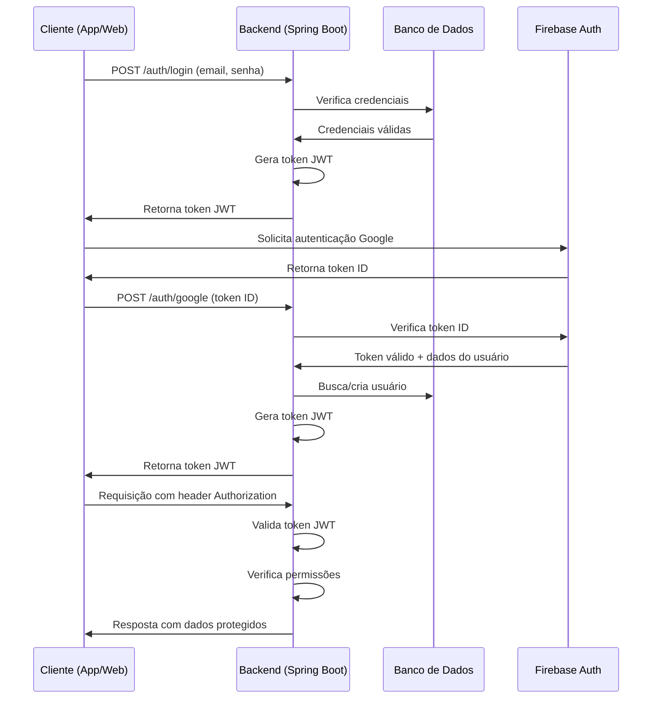

# Autenticação e Autorização

O FitLocus implementa um sistema robusto de autenticação e autorização para proteger os dados dos usuários e garantir que apenas usuários autorizados possam acessar recursos específicos.

## Visão Geral

O sistema de autenticação do FitLocus combina:

1. **Autenticação Tradicional**: Login com email e senha
2. **Autenticação Social**: Login com Google via Firebase Auth
3. **Tokens JWT**: Para autenticação stateless entre cliente e servidor
4. **Controle de Acesso**: Baseado em tipos de usuário e níveis de assinatura

## Fluxo de Autenticação



## Implementação no Backend

### Configuração de Segurança

O backend utiliza Spring Security para configurar a segurança da API:

```java
@Configuration
@EnableWebSecurity
public class SecurityConfig {
    
    @Bean
    public SecurityFilterChain securityFilterChain(HttpSecurity http) throws Exception {
        http
            .csrf().disable()
            .authorizeHttpRequests(authorize -> authorize
                .requestMatchers("/auth/**").permitAll()
                .requestMatchers("/api/public/**").permitAll()
                .anyRequest().authenticated()
            )
            .sessionManagement(session -> session
                .sessionCreationPolicy(SessionCreationPolicy.STATELESS)
            )
            .addFilterBefore(jwtAuthenticationFilter, UsernamePasswordAuthenticationFilter.class);
        
        return http.build();
    }
    
    // Outros beans e configurações...
}
```

### Filtro JWT

Um filtro personalizado processa e valida os tokens JWT em cada requisição:

```java
@Component
public class JwtAuthenticationFilter extends OncePerRequestFilter {
    
    @Override
    protected void doFilterInternal(
            HttpServletRequest request,
            HttpServletResponse response,
            FilterChain filterChain) throws ServletException, IOException {
        
        String token = extractTokenFromRequest(request);
        
        if (token != null && jwtService.validateToken(token)) {
            Authentication authentication = jwtService.getAuthentication(token);
            SecurityContextHolder.getContext().setAuthentication(authentication);
        }
        
        filterChain.doFilter(request, response);
    }
    
    // Métodos auxiliares...
}
```

### Serviço JWT

Um serviço dedicado gerencia a criação, validação e extração de informações dos tokens JWT:

```java
@Service
public class JwtService {
    
    @Value("${jwt.secret}")
    private String jwtSecret;
    
    @Value("${jwt.expiration}")
    private long jwtExpiration;
    
    public String generateToken(UserDetails userDetails) {
        Map<String, Object> claims = new HashMap<>();
        User user = (User) userDetails;
        
        claims.put("id", user.getId());
        claims.put("email", user.getEmail());
        claims.put("userType", user.getUserType());
        claims.put("subscriptionType", user.getSubscriptionType());
        
        return Jwts.builder()
                .setClaims(claims)
                .setSubject(userDetails.getUsername())
                .setIssuedAt(new Date())
                .setExpiration(new Date(System.currentTimeMillis() + jwtExpiration))
                .signWith(SignatureAlgorithm.HS512, jwtSecret)
                .compact();
    }
    
    // Métodos para validação e extração de informações...
}
```

### Integração com Firebase Auth

Para autenticação social, o backend integra-se com o Firebase Auth:

```java
@Service
public class FirebaseAuthService {
    
    private final FirebaseAuth firebaseAuth;
    
    public FirebaseAuthService(FirebaseAuth firebaseAuth) {
        this.firebaseAuth = firebaseAuth;
    }
    
    public FirebaseToken verifyIdToken(String idToken) throws FirebaseAuthException {
        return firebaseAuth.verifyIdToken(idToken);
    }
    
    // Outros métodos relacionados ao Firebase Auth...
}
```

## Implementação no Frontend

### Armazenamento de Token

No frontend, o token JWT é armazenado de forma segura:

```typescript
// Web (Next.js)
export const TOKEN_NAME = "fitlocus_auth_token";

export const setToken = (token: string) => {
  Cookies.set(TOKEN_NAME, token, { expires: 7, path: "/" });
};

export const getToken = () => {
  return Cookies.get(TOKEN_NAME);
};

export const removeToken = () => {
  Cookies.remove(TOKEN_NAME, { path: "/" });
};

// Mobile (React Native)
export const setToken = async (token: string) => {
  await AsyncStorage.setItem(TOKEN_NAME, token);
};

export const getToken = async () => {
  return await AsyncStorage.getItem(TOKEN_NAME);
};

export const removeToken = async () => {
  await AsyncStorage.removeItem(TOKEN_NAME);
};
```

### Contexto de Autenticação

Um contexto React gerencia o estado de autenticação:

```typescript
export const AuthContext = createContext<AuthContextData>({} as AuthContextData);

export const AuthProvider = ({ children }: { children: React.ReactNode }) => {
  const [user, setUser] = useState<User | null>(null);
  const [loading, setLoading] = useState(true);
  
  useEffect(() => {
    const loadUser = async () => {
      const token = getToken();
      
      if (token) {
        try {
          const user = await authService.getAuthenticatedUser();
          setUser(user);
        } catch (error) {
          removeToken();
        }
      }
      
      setLoading(false);
    };
    
    loadUser();
  }, []);
  
  const login = async (credentials: LoginCredentials) => {
    const response = await authService.login(credentials);
    setToken(response.token);
    setUser(response);
    return response;
  };
  
  const register = async (userData: RegisterData) => {
    const response = await authService.register(userData);
    setToken(response.token);
    setUser(response);
    return response;
  };
  
  const loginWithGoogle = async (token: string, userType: string) => {
    const response = await authService.handleGoogleAuth(token, userType);
    setToken(response.token);
    setUser(response);
    return response;
  };
  
  const logout = () => {
    removeToken();
    setUser(null);
  };
  
  return (
    <AuthContext.Provider value={{ user, loading, login, logout, register, loginWithGoogle }}>
      {children}
    </AuthContext.Provider>
  );
};

export const useAuth = () => {
  const context = useContext(AuthContext);
  
  if (!context) {
    throw new Error('useAuth must be used within an AuthProvider');
  }
  
  return context;
};
```

### Proteção de Rotas

#### Web (Next.js)

No Next.js, um middleware protege as rotas que requerem autenticação:

```typescript
export function middleware(request: NextRequest) {
  const token = request.cookies.get(TOKEN_NAME)?.value;
  const isAuthRoute = request.nextUrl.pathname.startsWith('/login') || 
                      request.nextUrl.pathname.startsWith('/registro');
  const isDashboardRoute = request.nextUrl.pathname.startsWith('/dashboard');
  
  if (!token && isDashboardRoute) {
    return NextResponse.redirect(new URL('/login', request.url));
  }
  
  if (token && isAuthRoute) {
    return NextResponse.redirect(new URL('/dashboard', request.url));
  }
  
  return NextResponse.next();
}

export const config = {
  matcher: ['/dashboard/:path*', '/login', '/registro'],
};
```

#### Mobile (React Native)

No React Native, um componente de rota protegida controla o acesso:

```typescript
const ProtectedRoute = ({ children }: { children: React.ReactNode }) => {
  const { user, loading } = useAuth();
  const navigation = useNavigation();
  
  useEffect(() => {
    if (!loading && !user) {
      navigation.navigate('Login');
    }
  }, [user, loading, navigation]);
  
  if (loading) {
    return <LoadingScreen />;
  }
  
  return user ? <>{children}</> : null;
};
```

## Autorização

Além da autenticação, o sistema implementa autorização baseada em:

### Tipos de Usuário

O sistema suporta diferentes tipos de usuário com permissões específicas:

```java
public enum EnumUserType {
    ALUNO,
    PERSONAL
}
```

### Níveis de Assinatura

Os recursos disponíveis também dependem do nível de assinatura do usuário:

```java
public enum SubscriptionType {
    FREEMIUM,
    TRIAL,
    PREMIUM_MENSAL,
    PREMIUM_SEMESTRAL,
    PREMIUM_ANUAL,
    PERSONAL_INICIANTE,      // até 10
    PERSONAL_BASIC,          // até 50
    PERSONAL_INTERMEDIARIO,  // até 100
    PERSONAL_AVANCADO,       // até 200
    PERSONAL_ILIMITADO       // 201+
}
```

### Validadores de Acesso

Validadores específicos controlam o acesso a recursos premium:

```java
@Component
public class SubscriptionValidator {
    
    public boolean canAccessPremiumFeature(User user) {
        if (user.getSubscriptionType() == SubscriptionType.FREEMIUM) {
            return false;
        }
        
        if (user.getSubscriptionType() == SubscriptionType.TRIAL) {
            LocalDate trialStartDate = user.getTrialStartDate();
            LocalDate now = LocalDate.now();
            
            return trialStartDate != null && 
                   ChronoUnit.DAYS.between(trialStartDate, now) <= 7;
        }
        
        return true;
    }
    
    // Outros métodos de validação...
}
```

## Segurança Adicional

O sistema implementa medidas adicionais de segurança:

### Proteção contra CSRF

Configuração para proteção contra ataques CSRF em endpoints sensíveis.

### Limitação de Taxa

Limitação de tentativas de login para prevenir ataques de força bruta:

```java
@Component
public class LoginAttemptService {
    
    private final LoadingCache<String, Integer> attemptsCache;
    
    public LoginAttemptService() {
        attemptsCache = CacheBuilder.newBuilder()
                .expireAfterWrite(1, TimeUnit.DAYS)
                .build(new CacheLoader<String, Integer>() {
                    @Override
                    public Integer load(String key) {
                        return 0;
                    }
                });
    }
    
    public void loginSucceeded(String key) {
        attemptsCache.invalidate(key);
    }
    
    public void loginFailed(String key) {
        int attempts = 0;
        try {
            attempts = attemptsCache.get(key);
        } catch (ExecutionException e) {
            attempts = 0;
        }
        attempts++;
        attemptsCache.put(key, attempts);
    }
    
    public boolean isBlocked(String key) {
        try {
            return attemptsCache.get(key) >= 5;
        } catch (ExecutionException e) {
            return false;
        }
    }
}
```

### Validação de Entrada

Validação rigorosa de todas as entradas do usuário para prevenir injeções e outros ataques.

### Logs de Segurança

Registro de eventos de segurança para auditoria e detecção de atividades suspeitas.

## Fluxo de Recuperação de Senha

O sistema também implementa um fluxo de recuperação de senha:

1. Usuário solicita redefinição de senha fornecendo email
2. Sistema gera token de redefinição com expiração
3. Email enviado com link contendo o token
4. Usuário acessa o link e define nova senha
5. Sistema valida o token e atualiza a senha

## Considerações de Segurança

- Senhas armazenadas com hash usando BCrypt
- Tokens JWT com tempo de expiração curto (1 hora)
- Renovação de tokens para sessões mais longas
- Validação de origem de requisições (CORS)
- Sanitização de dados de entrada e saída
