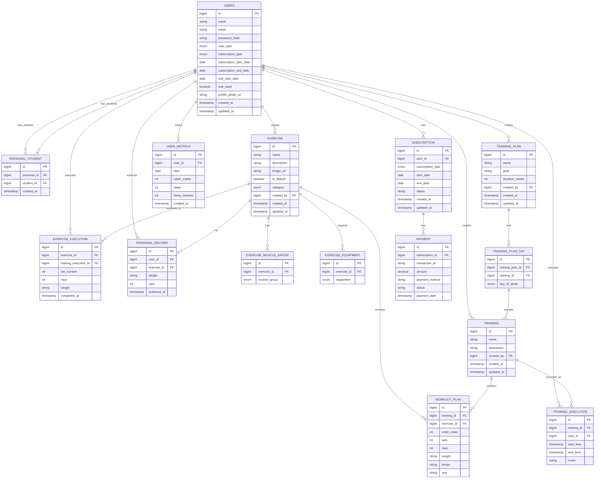

# Banco de Dados

O FitLocus utiliza PostgreSQL como sistema de gerenciamento de banco de dados relacional para armazenar e gerenciar todos os dados da aplicação. Este documento descreve a estrutura do banco de dados, incluindo tabelas, relacionamentos e considerações de design.

## Visão Geral

O banco de dados do FitLocus é projetado para suportar as principais funcionalidades da plataforma:

- Gerenciamento de usuários (alunos e personal trainers)
- Relacionamento entre personal trainers e alunos
- Exercícios e categorias
- Treinos e planos de treino
- Execução de treinos e exercícios
- Assinaturas e pagamentos
- Métricas e recordes pessoais

## Modelo de Dados



## Principais Tabelas

### Users

A tabela `users` armazena informações sobre todos os usuários do sistema, incluindo alunos e personal trainers.

| Coluna | Tipo | Descrição |
|--------|------|-----------|
| `id` | BIGINT | Identificador único do usuário |
| `name` | VARCHAR(255) | Nome completo do usuário |
| `email` | VARCHAR(255) | Email do usuário (único) |
| `password_hash` | VARCHAR(255) | Hash da senha do usuário |
| `user_type` | VARCHAR(20) | Tipo de usuário (ALUNO ou PERSONAL) |
| `subscription_type` | VARCHAR(50) | Tipo de assinatura do usuário |
| `subscription_start_date` | DATE | Data de início da assinatura |
| `subscription_end_date` | DATE | Data de término da assinatura (null para assinaturas sem prazo) |
| `trial_start_date` | DATE | Data de início do período de teste |
| `trial_used` | BOOLEAN | Indica se o usuário já utilizou o período de teste |
| `profile_photo_url` | VARCHAR(255) | URL da foto de perfil do usuário |
| `created_at` | TIMESTAMP | Data de criação do registro |
| `updated_at` | TIMESTAMP | Data da última atualização do registro |

### Personal_Student

A tabela `personal_student` estabelece o relacionamento entre personal trainers e seus alunos.

| Coluna | Tipo | Descrição |
|--------|------|-----------|
| `id` | BIGINT | Identificador único do relacionamento |
| `personal_id` | BIGINT | ID do personal trainer (referência à tabela users) |
| `student_id` | BIGINT | ID do aluno (referência à tabela users) |
| `created_at` | TIMESTAMP | Data de criação do relacionamento |

### Exercise

A tabela `exercise` armazena informações sobre exercícios físicos.

| Coluna | Tipo | Descrição |
|--------|------|-----------|
| `id` | BIGINT | Identificador único do exercício |
| `name` | VARCHAR(255) | Nome do exercício |
| `description` | TEXT | Descrição detalhada do exercício |
| `image_url` | VARCHAR(255) | URL da imagem do exercício |
| `is_default` | BOOLEAN | Indica se é um exercício padrão do sistema |
| `category` | VARCHAR(50) | Categoria do exercício (PEITO, COSTAS, etc.) |
| `created_by` | BIGINT | ID do usuário que criou o exercício |
| `created_at` | TIMESTAMP | Data de criação do registro |
| `updated_at` | TIMESTAMP | Data da última atualização do registro |

### Training

A tabela `training` armazena informações sobre treinos.

| Coluna | Tipo | Descrição |
|--------|------|-----------|
| `id` | BIGINT | Identificador único do treino |
| `name` | VARCHAR(255) | Nome do treino |
| `description` | TEXT | Descrição do treino |
| `created_by` | BIGINT | ID do usuário que criou o treino |
| `created_at` | TIMESTAMP | Data de criação do registro |
| `updated_at` | TIMESTAMP | Data da última atualização do registro |

### Workout_Plan

A tabela `workout_plan` estabelece a relação entre treinos e exercícios, incluindo detalhes como séries, repetições e peso.

| Coluna | Tipo | Descrição |
|--------|------|-----------|
| `id` | BIGINT | Identificador único do plano de workout |
| `training_id` | BIGINT | ID do treino (referência à tabela training) |
| `exercise_id` | BIGINT | ID do exercício (referência à tabela exercise) |
| `order_index` | INT | Ordem do exercício no treino |
| `sets` | INT | Número de séries |
| `reps` | INT | Número de repetições |
| `weight` | VARCHAR(50) | Peso recomendado (pode incluir variações) |
| `tempo` | VARCHAR(50) | Tempo de execução (formato: concêntrica/isométrica/excêntrica) |
| `rest` | VARCHAR(50) | Tempo de descanso entre séries |

### Training_Plan

A tabela `training_plan` armazena informações sobre planos de treino semanais.

| Coluna | Tipo | Descrição |
|--------|------|-----------|
| `id` | BIGINT | Identificador único do plano de treino |
| `name` | VARCHAR(255) | Nome do plano de treino |
| `goal` | TEXT | Objetivo do plano de treino |
| `duration_weeks` | INT | Duração do plano em semanas |
| `created_by` | BIGINT | ID do usuário que criou o plano |
| `created_at` | TIMESTAMP | Data de criação do registro |
| `updated_at` | TIMESTAMP | Data da última atualização do registro |

## Índices

O banco de dados utiliza índices para otimizar consultas frequentes:

| Tabela | Coluna(s) | Tipo | Descrição |
|--------|-----------|------|-----------|
| `users` | `email` | UNIQUE | Garante emails únicos e acelera consultas por email |
| `users` | `user_type` | BTREE | Otimiza consultas filtradas por tipo de usuário |
| `personal_student` | `personal_id` | BTREE | Otimiza consultas para listar alunos de um personal |
| `personal_student` | `student_id` | BTREE | Otimiza consultas para encontrar o personal de um aluno |
| `exercise` | `category` | BTREE | Otimiza consultas filtradas por categoria |
| `exercise` | `created_by` | BTREE | Otimiza consultas para listar exercícios de um usuário |
| `training` | `created_by` | BTREE | Otimiza consultas para listar treinos de um usuário |
| `training_execution` | `user_id` | BTREE | Otimiza consultas para histórico de treinos de um usuário |
| `training_execution` | `start_time` | BTREE | Otimiza consultas por período |

## Restrições e Integridade Referencial

O banco de dados implementa as seguintes restrições para garantir a integridade dos dados:

- **Chaves Estrangeiras**: Todas as referências entre tabelas são implementadas como chaves estrangeiras com ações de cascata apropriadas
- **Restrições de Unicidade**: Emails de usuários são únicos
- **Restrições de Não-Nulidade**: Campos obrigatórios são marcados como NOT NULL
- **Restrições de Verificação**: Validação de valores para campos como subscription_type e user_type

## Migrações e Versionamento

O banco de dados é gerenciado através de migrações usando Liquibase:

```
src/main/resources/db/
├── changelog.xml           # Arquivo mestre de migração
└── scripts/
    ├── 001-initial-schema.sql  # Esquema inicial
    ├── 002-add-subscription.sql # Adição de tabelas de assinatura
    └── ...                 # Outras migrações
```

Cada alteração no esquema do banco de dados é versionada e aplicada sequencialmente, garantindo consistência entre ambientes.

## Considerações de Performance

Para garantir a performance do banco de dados, as seguintes estratégias são implementadas:

- **Índices**: Índices estratégicos para consultas frequentes
- **Paginação**: Todas as consultas que retornam grandes conjuntos de dados implementam paginação
- **Consultas Otimizadas**: Uso de JOINs eficientes e subconsultas apenas quando necessário
- **Transações**: Uso apropriado de transações para garantir consistência

## Segurança de Dados

A segurança dos dados é garantida através de:

- **Criptografia**: Senhas armazenadas com hash usando BCrypt
- **Acesso Restrito**: Acesso ao banco de dados limitado a serviços autorizados
- **Backup**: Backups automáticos diários com retenção de 30 dias
- **Auditoria**: Registro de alterações em tabelas sensíveis

## Ambiente de Desenvolvimento

Para desenvolvimento local, um contêiner Docker com PostgreSQL é configurado:

```yaml
# docker-compose.yml
version: '3.8'
services:
  postgres:
    image: postgres:14
    environment:
      POSTGRES_DB: fitlocus
      POSTGRES_USER: fitlocus
      POSTGRES_PASSWORD: fitlocus
    ports:
      - "5432:5432"
    volumes:
      - postgres_data:/var/lib/postgresql/data

volumes:
  postgres_data:
```

## Ambiente de Produção

Em produção, o banco de dados é hospedado no Google Cloud SQL:

- **Tipo**: PostgreSQL 14
- **Configuração**: 2 vCPUs, 8GB RAM
- **Armazenamento**: 100GB SSD com expansão automática
- **Backup**: Automático diário com retenção de 30 dias
- **Alta Disponibilidade**: Configuração com réplica de leitura
- **Monitoramento**: Alertas para uso de CPU, memória e espaço em disco
