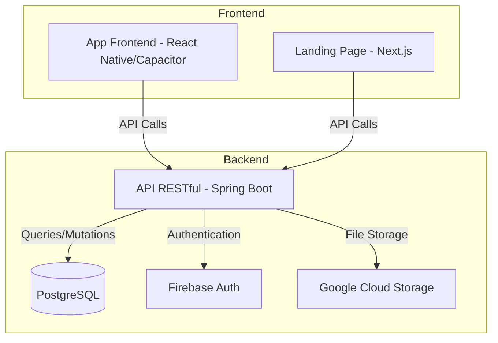

# Arquitetura do FitLocus

O FitLocus é uma plataforma completa para gerenciamento de treinos e relacionamento entre personal trainers e alunos. A arquitetura do sistema é composta por três componentes principais que trabalham em conjunto para oferecer uma experiência completa aos usuários.

## Componentes Principais

<CardGroup cols={3}>
  <Card title="Backend" icon="server" href="/architecture/backend">
    API RESTful em Java/Spring Boot que gerencia toda a lógica de negócio, autenticação e persistência de dados.
  </Card>
  <Card title="App Frontend" icon="mobile" href="/architecture/frontend">
    Aplicativo móvel em React Native com Capacitor que oferece a experiência principal para usuários.
  </Card>
  <Card title="Landing Page" icon="browser" href="/architecture/landing">
    Site institucional em Next.js que serve como portal de entrada para novos usuários.
  </Card>
</CardGroup>

## Diagrama de Arquitetura

## Infraestrutura

O FitLocus utiliza a Google Cloud Platform (GCP) como sua infraestrutura principal:

- **Backend**: Implantado no Cloud Run como contêineres Docker
- **Banco de Dados**: PostgreSQL gerenciado no Cloud SQL
- **Armazenamento**: Google Cloud Storage para imagens e arquivos
- **Autenticação**: Firebase Authentication para gerenciamento de usuários
- **CI/CD**: GitHub Actions para integração e implantação contínuas

## Fluxo de Dados

1. Os usuários interagem com o aplicativo móvel (alunos e personal trainers) ou com a landing page (novos usuários)
2. As requisições são enviadas para a API RESTful no backend
3. O backend processa as requisições, interage com o banco de dados e serviços externos
4. Os dados são retornados para o frontend em formato JSON
5. O frontend renderiza os dados para o usuário

## Segurança

A segurança do sistema é garantida por:

- **Autenticação**: JWT (JSON Web Tokens) para autenticação de API
- **Autorização**: Controle de acesso baseado em funções (RBAC)
- **Criptografia**: HTTPS para todas as comunicações
- **Validação**: Validação de entrada em todos os endpoints
- **Proteção contra ataques**: Limitação de taxa, proteção contra CSRF, etc.

## Escalabilidade

A arquitetura foi projetada para escalar horizontalmente:

- **Stateless Backend**: Permite múltiplas instâncias sem estado
- **Banco de Dados Escalável**: PostgreSQL com capacidade de escalar verticalmente
- **Cache**: Implementação de cache para reduzir carga no banco de dados
- **CDN**: Conteúdo estático servido através de CDN

## Próximos Passos

Para entender melhor cada componente da arquitetura, consulte as páginas específicas:

- [Backend](/architecture/backend)
- [App Frontend](/architecture/frontend)
- [Landing Page](/architecture/landing)
- [Autenticação](/architecture/authentication)
- [Banco de Dados](/architecture/database)
