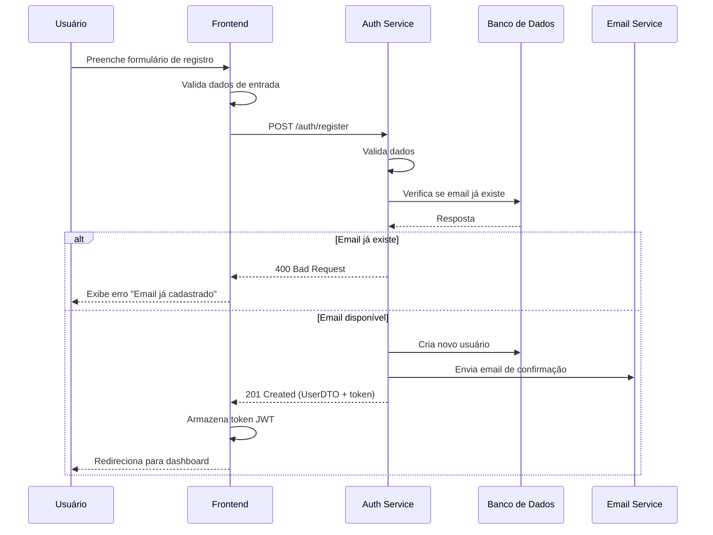
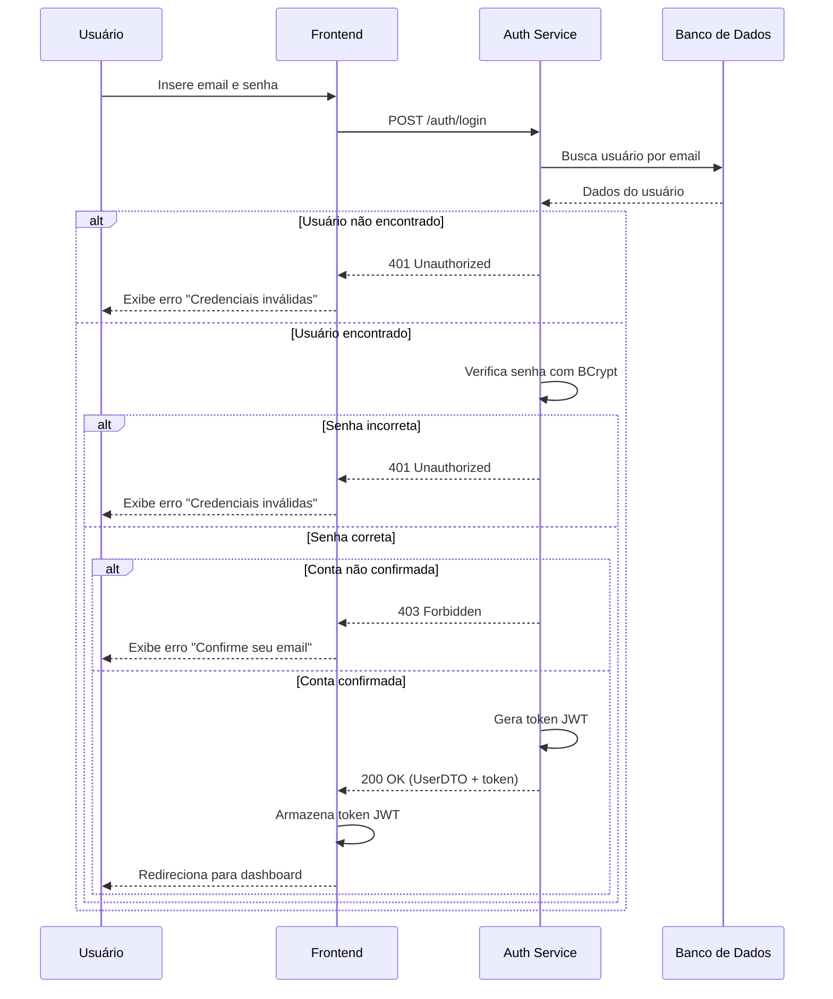
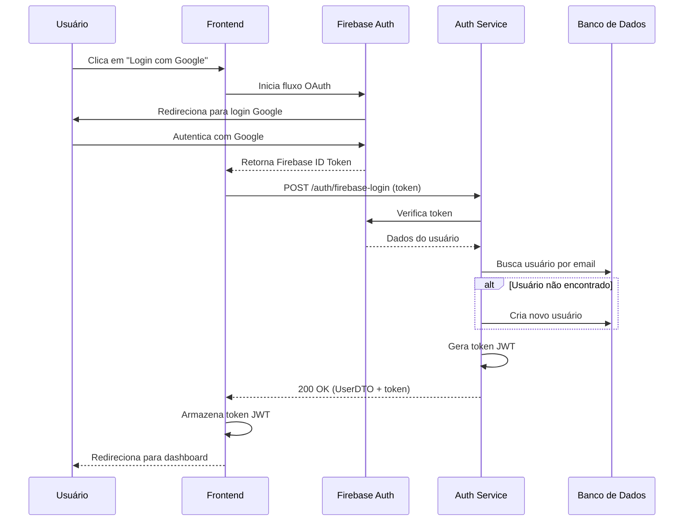
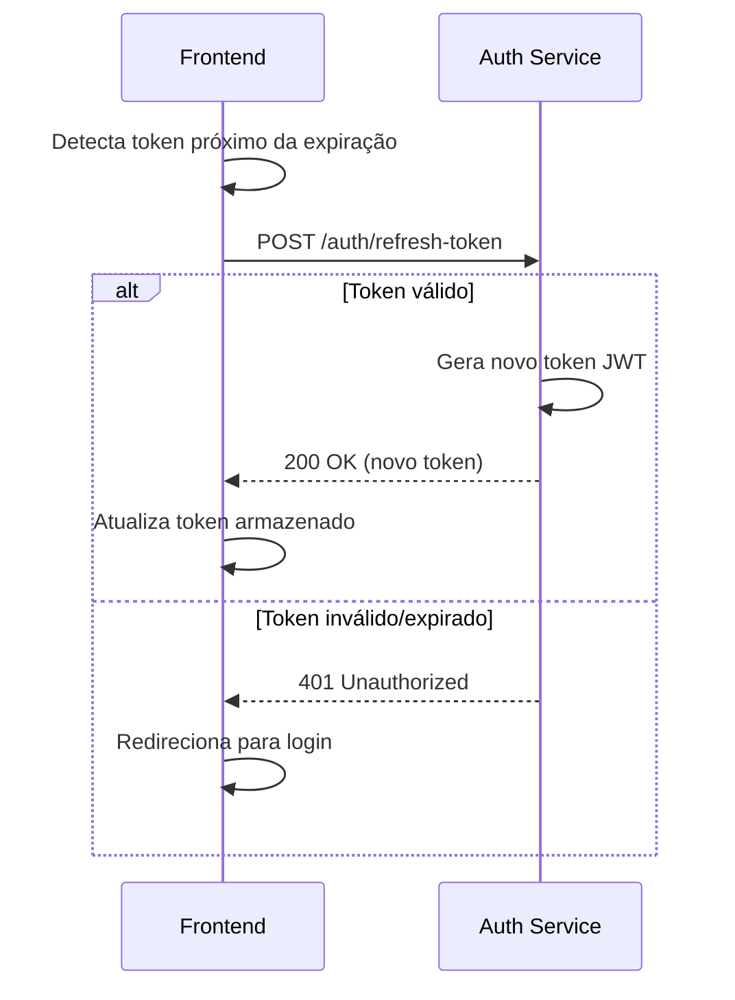
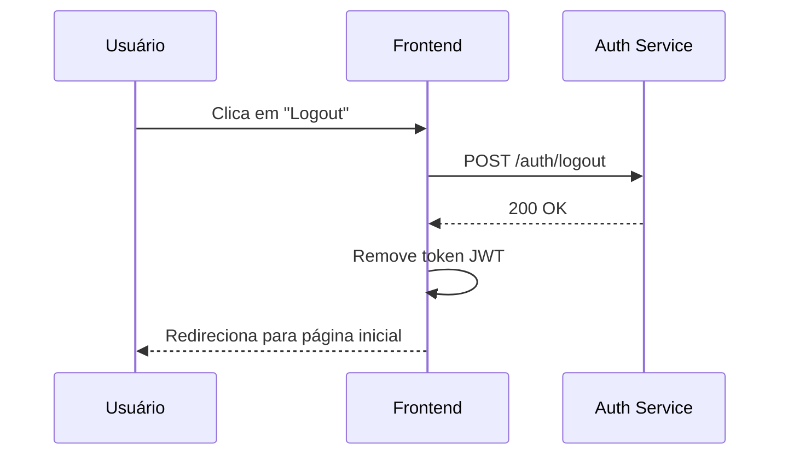
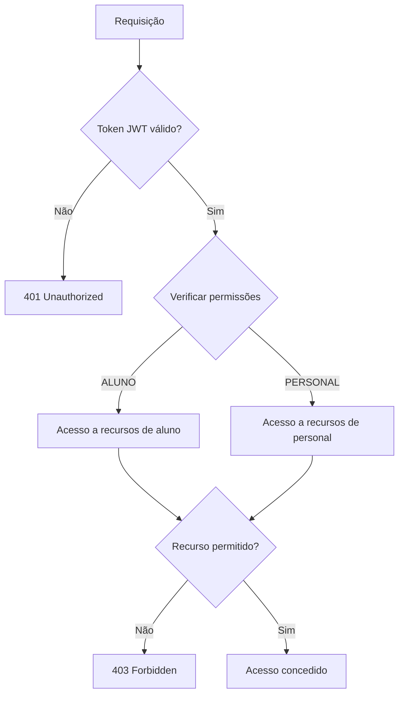

# Fluxo de Autenticação

Este diagrama ilustra o processo completo de autenticação no ecossistema FitLocus, incluindo registro, login e renovação de tokens.

## Visão Geral

<Frame>
  <div style={{ padding: '24px', backgroundColor: '#f9f9f9', borderRadius: '8px' }}>
    <p>
      O sistema de autenticação do FitLocus utiliza:
    </p>
    <ul>
      <li>Autenticação baseada em JWT (JSON Web Tokens)</li>
      <li>Integração com Firebase Authentication</li>
      <li>Controle de acesso baseado em tipos de usuário</li>
      <li>Renovação automática de tokens</li>
    </ul>
  </div>
</Frame>

## Diagrama de Fluxo de Autenticação

<Frame>
  
</Frame>

## Processo de Registro

O processo de registro de usuários no FitLocus segue estas etapas:



### Detalhes do Processo

1. **Validação de Dados**:
   - Email válido e único
   - Senha com pelo menos 8 caracteres, incluindo letras e números
   - Nome completo obrigatório

2. **Criação de Conta**:
   - Geração de ID único
   - Hash da senha com BCrypt
   - Definição do tipo de usuário (ALUNO/PERSONAL)
   - Armazenamento no banco de dados

3. **Confirmação de Email**:
   - Geração de token de confirmação
   - Envio de email com link de confirmação
   - Expiração do token após 24 horas

## Processo de Login

O processo de login no FitLocus segue estas etapas:



### Detalhes do Token JWT

O token JWT gerado pelo FitLocus contém as seguintes informações:

```json
{
  "sub": "user_id",
  "name": "Nome do Usuário",
  "email": "usuario@exemplo.com",
  "userType": "PERSONAL",
  "iat": 1619712000,
  "exp": 1619798400
}
```

- **sub**: ID do usuário
- **name**: Nome completo do usuário
- **email**: Email do usuário
- **userType**: Tipo de usuário (ALUNO/PERSONAL)
- **iat**: Timestamp de emissão do token
- **exp**: Timestamp de expiração do token (24 horas após emissão)

## Integração com Firebase

O FitLocus também suporta autenticação via Firebase, seguindo este fluxo:



## Renovação de Token

O processo de renovação automática de tokens segue estas etapas:



## Logout

O processo de logout segue estas etapas:



## Controle de Acesso

O FitLocus implementa controle de acesso baseado em tipos de usuário:



### Permissões por Tipo de Usuário

| Recurso | ALUNO | PERSONAL |
|---------|-------|----------|
| Ver próprio perfil | ✅ | ✅ |
| Editar próprio perfil | ✅ | ✅ |
| Ver treinos atribuídos | ✅ | ✅ |
| Criar treinos | ❌ | ✅ |
| Atribuir treinos | ❌ | ✅ |
| Ver lista de alunos | ❌ | ✅ |
| Gerenciar exercícios | ❌ | ✅ |

## Considerações de Segurança

1. **Proteção contra CSRF**:
   - Tokens JWT são armazenados em localStorage
   - Implementação de CORS para restringir origens

2. **Proteção contra XSS**:
   - Sanitização de inputs
   - Content Security Policy (CSP)

3. **Rate Limiting**:
   - Limite de 10 tentativas de login por minuto
   - Bloqueio temporário após múltiplas falhas

4. **Monitoramento**:
   - Logging de tentativas de login
   - Alertas para atividades suspeitas

## Implementação no Frontend

No frontend, a autenticação é gerenciada através de um contexto de autenticação:

```tsx
// src/contexts/AuthContext.tsx
import React, { createContext, useContext, useState, useEffect } from 'react';
import api from '../services/api';

interface AuthContextData {
  user: User | null;
  loading: boolean;
  login: (email: string, password: string) => Promise<void>;
  loginWithGoogle: () => Promise<void>;
  logout: () => void;
  isAuthenticated: boolean;
}

const AuthContext = createContext<AuthContextData>({} as AuthContextData);

export const AuthProvider: React.FC = ({ children }) => {
  // Implementação omitida para brevidade
};

export const useAuth = () => useContext(AuthContext);
```

## Implementação no Backend

No backend, a autenticação é gerenciada através de filtros JWT:

```java
@Component
public class JwtAuthenticationFilter extends OncePerRequestFilter {
    private final JwtTokenProvider tokenProvider;
    private final UserDetailsService userDetailsService;
    
    // Implementação omitida para brevidade
}
```

## Recursos Adicionais

- [Documentação da API de Autenticação](/api-reference/authentication)
- [Tutorial de Implementação de Autenticação](/tutorials/implement-authentication)
- [Exemplos de Código de Integração](/integration/authentication)
