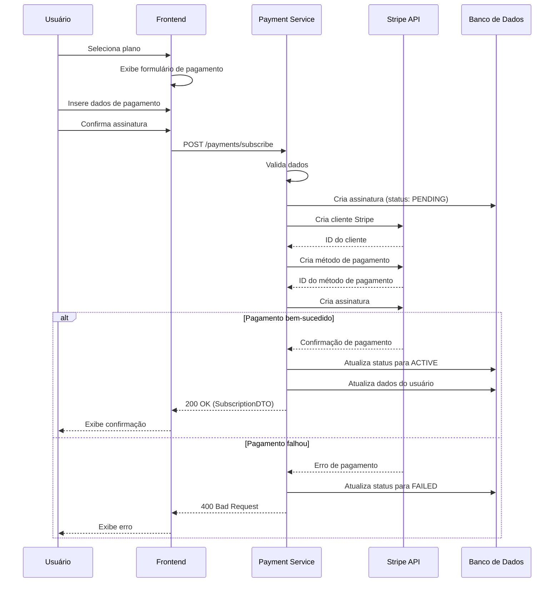
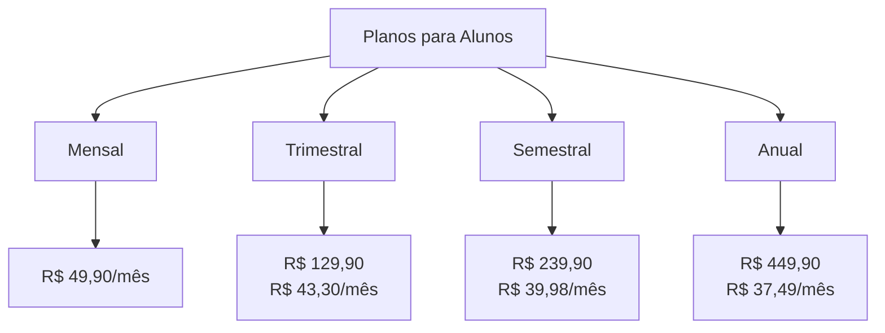
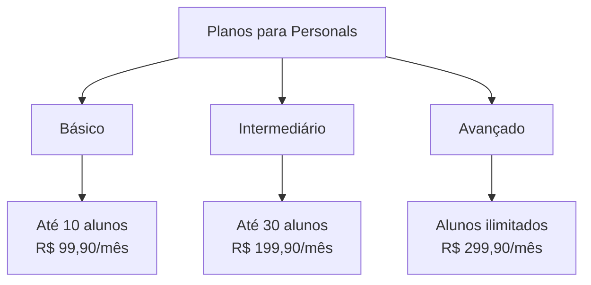
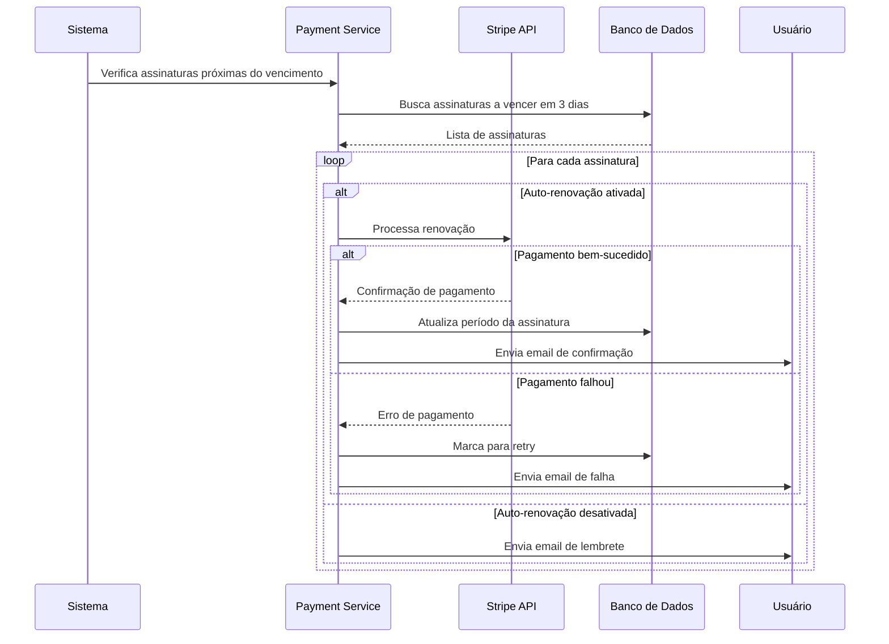
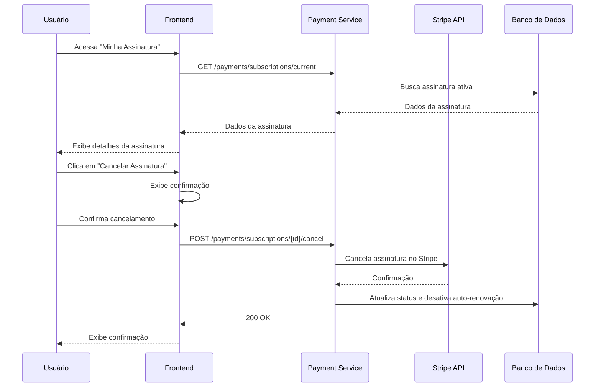
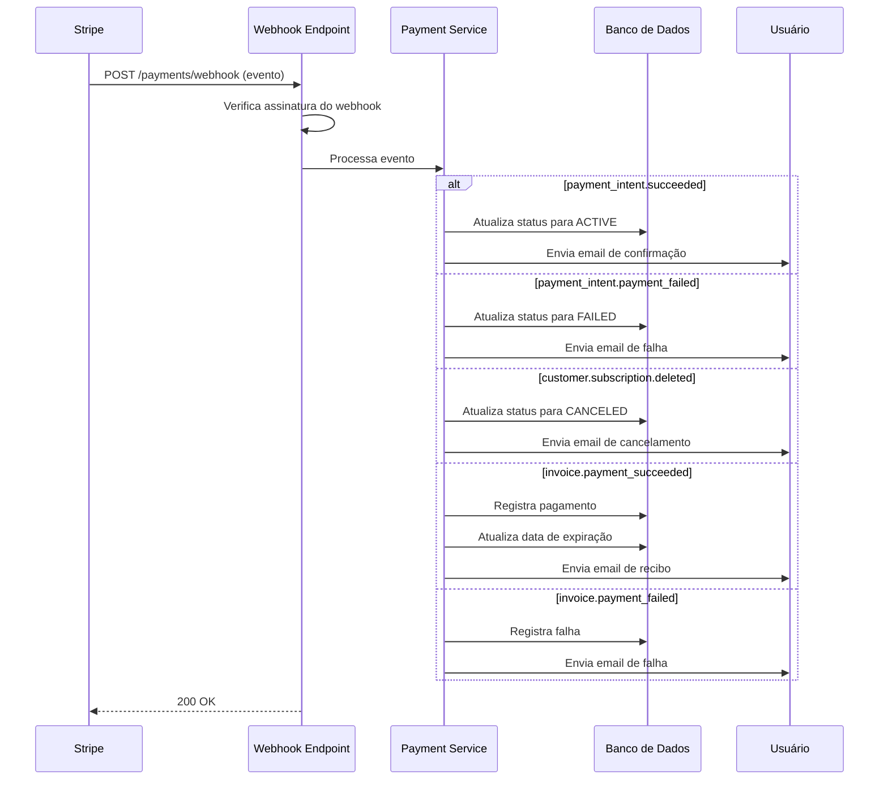

# Processamento de Pagamentos

Este diagrama ilustra o processo completo de processamento de pagamentos e gerenciamento de assinaturas no ecossistema FitLocus.

## Visão Geral

<Frame>
  <div style={{ padding: '24px', backgroundColor: '#f9f9f9', borderRadius: '8px' }}>
    <p>
      O sistema de pagamentos do FitLocus permite:
    </p>
    <ul>
      <li>Processamento de assinaturas para diferentes planos</li>
      <li>Integração com gateway de pagamento (Stripe)</li>
      <li>Gerenciamento de ciclos de cobrança</li>
      <li>Renovação automática de assinaturas</li>
      <li>Cancelamento e reembolso de assinaturas</li>
    </ul>
  </div>
</Frame>

## Diagrama de Fluxo de Pagamento

<Frame>
  
</Frame>

## Processo de Assinatura

O processo de assinatura no FitLocus segue estas etapas:



### Detalhes do Processo

1. **Seleção de Plano**:
   - Planos para alunos (Mensal, Trimestral, Semestral, Anual)
   - Planos para personals (Básico, Intermediário, Avançado)
   - Preços e benefícios de cada plano

2. **Processamento de Pagamento**:
   - Integração com Stripe para processamento seguro
   - Suporte a cartão de crédito, PIX e boleto
   - Tokenização de dados de pagamento

3. **Confirmação e Ativação**:
   - Confirmação imediata para pagamentos com cartão
   - Verificação de pagamento para PIX e boleto
   - Ativação da assinatura após confirmação

## Estrutura de Dados de Assinatura

```json
{
  "id": 1,
  "userId": 123,
  "subscriptionType": "MENSAL",
  "startDate": "2023-05-15T00:00:00Z",
  "endDate": "2023-06-15T00:00:00Z",
  "paymentId": "sub_1234567890",
  "paymentMethod": "CREDIT_CARD",
  "status": "ACTIVE",
  "autoRenew": true,
  "createdAt": "2023-05-15T14:30:00Z",
  "updatedAt": "2023-05-15T14:30:00Z",
  "user": {
    "id": 123,
    "name": "Maria Oliveira",
    "email": "maria.oliveira@exemplo.com",
    "userType": "ALUNO"
  }
}
```

## Planos de Assinatura

O FitLocus oferece diferentes planos de assinatura:

### Planos para Alunos



### Planos para Personal Trainers



## Processo de Renovação Automática

O processo de renovação automática de assinaturas segue estas etapas:



## Processo de Cancelamento

O processo de cancelamento de assinaturas segue estas etapas:



## Webhooks para Eventos de Pagamento

O FitLocus utiliza webhooks para processar eventos de pagamento:



## Implementação no Backend

No backend, o processamento de pagamentos é gerenciado pelo `PaymentController` e `PaymentService`:

```java
@RestController
@RequestMapping("/api/payments")
public class PaymentController {
    private final PaymentService paymentService;
    private final StripeWebhookService stripeWebhookService;
    
    // Implementação omitida para brevidade
    
    @PostMapping("/subscribe")
    public ResponseEntity<SubscriptionDTO> createSubscription(
            @Valid @RequestBody SubscriptionRequest request,
            Authentication authentication) {
        User user = (User) authentication.getPrincipal();
        SubscriptionDTO subscription = paymentService.createSubscription(request, user.getId());
        return ResponseEntity.status(HttpStatus.CREATED).body(subscription);
    }
    
    @PostMapping("/webhook")
    public ResponseEntity<Void> handleWebhook(
            @RequestBody String payload,
            @RequestHeader("Stripe-Signature") String signature) {
        try {
            stripeWebhookService.processWebhook(payload, signature);
            return ResponseEntity.ok().build();
        } catch (Exception e) {
            return ResponseEntity.status(HttpStatus.BAD_REQUEST).build();
        }
    }
}
```

## Implementação no Frontend

No frontend, o processamento de pagamentos é gerenciado através de componentes React:

```tsx
// src/components/SubscriptionCheckout.tsx
import React, { useState } from 'react';
import { useNavigate } from 'react-router-dom';
import { useStripe, useElements, CardElement } from '@stripe/react-stripe-js';
import paymentService from '../services/payment.service';

const SubscriptionCheckout: React.FC = () => {
  // Implementação omitida para brevidade
  
  return (
    <div className="subscription-checkout">
      <h2>Checkout - Plano {subscriptionType}</h2>
      
      <form onSubmit={handleSubmit}>
        {/* Campos do formulário */}
        
        <div className="card-element-container">
          <CardElement
            options={{
              style: {
                base: {
                  fontSize: '16px',
                  color: '#424770',
                  '::placeholder': {
                    color: '#aab7c4',
                  },
                },
                invalid: {
                  color: '#9e2146',
                },
              },
            }}
          />
        </div>
        
        <button type="submit" disabled={!stripe || loading}>
          {loading ? 'Processando...' : 'Finalizar Assinatura'}
        </button>
      </form>
    </div>
  );
};
```

## Considerações de Segurança

1. **Proteção de Dados de Pagamento**:
   - Nunca armazenar dados completos de cartão
   - Utilizar tokenização através do Stripe
   - Implementar TLS/SSL para todas as comunicações

2. **Validação de Webhooks**:
   - Verificar assinatura de webhooks
   - Implementar idempotência para evitar processamento duplicado
   - Validar origem das requisições

3. **Prevenção de Fraudes**:
   - Implementar verificações de segurança adicionais
   - Monitorar padrões suspeitos de transações
   - Utilizar ferramentas de detecção de fraude do Stripe

## Conformidade

1. **PCI DSS**:
   - Seguir diretrizes de conformidade PCI DSS
   - Utilizar gateway de pagamento certificado (Stripe)
   - Realizar auditorias regulares

2. **LGPD/GDPR**:
   - Armazenar apenas dados necessários
   - Implementar políticas de retenção de dados
   - Fornecer opções de exclusão de dados

## Recursos Adicionais

- [Documentação da API de Pagamentos](/api-reference/payments/overview)
- [Tutorial de Integração de Gateway de Pagamento](/tutorials/integrate-payment-gateway)
- [Exemplos de Código de Integração](/integration/payments)
- [Documentação do Stripe](https://stripe.com/docs)
