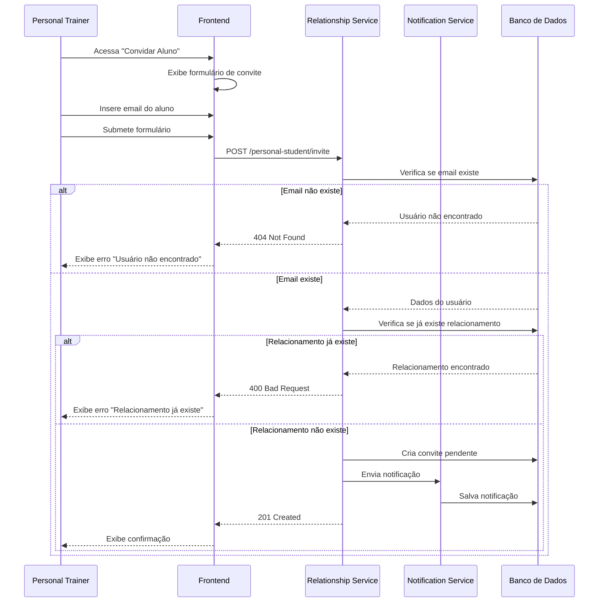
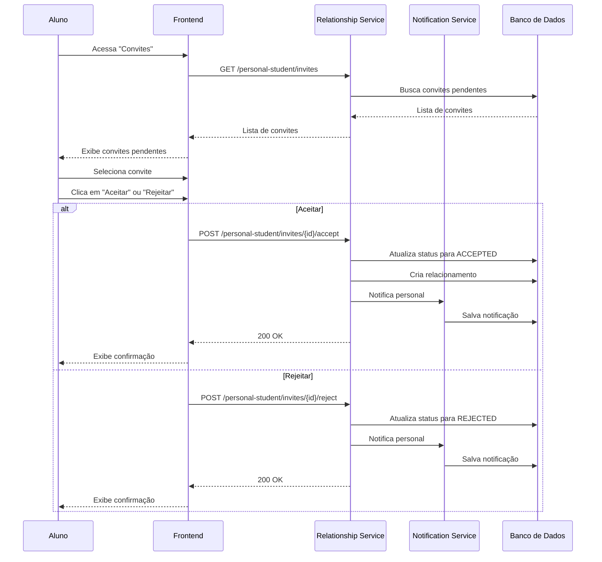
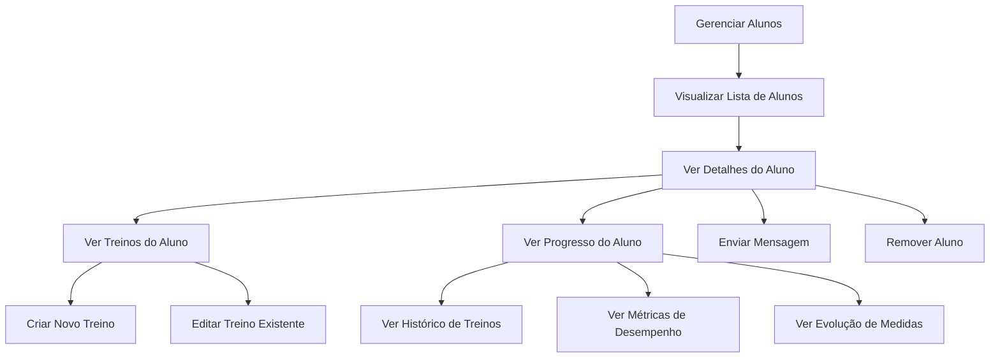

# Relacionamento Personal-Aluno

Este diagrama ilustra o processo completo de estabelecimento e gerenciamento do relacionamento entre personal trainers e alunos no ecossistema FitLocus.

## Visão Geral

<Frame>
  <div style={{ padding: '24px', backgroundColor: '#f9f9f9', borderRadius: '8px' }}>
    <p>
      O sistema de relacionamento personal-aluno do FitLocus permite:
    </p>
    <ul>
      <li>Convite de alunos por personal trainers</li>
      <li>Aceitação ou rejeição de convites por alunos</li>
      <li>Gerenciamento de alunos por personal trainers</li>
      <li>Visualização de métricas e progresso dos alunos</li>
      <li>Comunicação entre personal trainers e alunos</li>
    </ul>
  </div>
</Frame>

## Diagrama de Fluxo de Relacionamento

<Frame>
  
</Frame>

## Processo de Convite de Aluno

O processo de convite de alunos no FitLocus segue estas etapas:



### Detalhes do Processo

1. **Verificação de Usuário**:
   - Verificar se o email corresponde a um usuário registrado
   - Verificar se o usuário é do tipo ALUNO

2. **Verificação de Relacionamento**:
   - Verificar se já existe um relacionamento entre o personal e o aluno
   - Verificar se já existe um convite pendente

3. **Notificação**:
   - Envio de email ao aluno
   - Notificação no aplicativo
   - Detalhes do personal trainer no convite

## Processo de Aceitação de Convite

O processo de aceitação de convites no FitLocus segue estas etapas:



## Estrutura de Dados de Relacionamento

```json
{
  "id": 1,
  "personalId": 42,
  "studentId": 123,
  "status": "ACTIVE",
  "startDate": "2023-05-15T00:00:00Z",
  "endDate": null,
  "createdAt": "2023-05-10T14:30:00Z",
  "updatedAt": "2023-05-10T14:30:00Z",
  "personal": {
    "id": 42,
    "name": "João Silva",
    "email": "joao.silva@exemplo.com",
    "profilePicture": "https://storage.fitlocus.com/profiles/42.jpg"
  },
  "student": {
    "id": 123,
    "name": "Maria Oliveira",
    "email": "maria.oliveira@exemplo.com",
    "profilePicture": "https://storage.fitlocus.com/profiles/123.jpg"
  }
}
```

## Estrutura de Dados de Convite

```json
{
  "id": 5,
  "personalId": 42,
  "studentEmail": "maria.oliveira@exemplo.com",
  "status": "PENDING",
  "createdAt": "2023-05-10T14:30:00Z",
  "updatedAt": "2023-05-10T14:30:00Z",
  "expiresAt": "2023-05-17T14:30:00Z",
  "personal": {
    "id": 42,
    "name": "João Silva",
    "email": "joao.silva@exemplo.com",
    "profilePicture": "https://storage.fitlocus.com/profiles/42.jpg"
  }
}
```

## Gerenciamento de Alunos

O personal trainer pode gerenciar seus alunos através das seguintes ações:



## Implementação no Backend

No backend, o relacionamento personal-aluno é gerenciado pelo `PersonalStudentController` e `PersonalStudentService`:

```java
@RestController
@RequestMapping("/api/personal-student")
public class PersonalStudentController {
    private final PersonalStudentService personalStudentService;
    private final NotificationService notificationService;
    
    // Implementação omitida para brevidade
    
    @PostMapping("/invite")
    public ResponseEntity<PersonalStudentInviteDTO> inviteStudent(
            @Valid @RequestBody PersonalStudentInviteRequest request,
            Authentication authentication) {
        User user = (User) authentication.getPrincipal();
        PersonalStudentInviteDTO invite = personalStudentService.inviteStudent(request, user.getId());
        return ResponseEntity.status(HttpStatus.CREATED).body(invite);
    }
    
    @PostMapping("/invites/{id}/accept")
    public ResponseEntity<PersonalStudentRelationshipDTO> acceptInvite(
            @PathVariable Long id,
            Authentication authentication) {
        User user = (User) authentication.getPrincipal();
        PersonalStudentRelationshipDTO relationship = personalStudentService.acceptInvite(id, user.getId());
        return ResponseEntity.ok(relationship);
    }
    
    @PostMapping("/invites/{id}/reject")
    public ResponseEntity<Void> rejectInvite(
            @PathVariable Long id,
            Authentication authentication) {
        User user = (User) authentication.getPrincipal();
        personalStudentService.rejectInvite(id, user.getId());
        return ResponseEntity.ok().build();
    }
    
    @GetMapping("/students")
    public ResponseEntity<List<StudentDTO>> getStudents(Authentication authentication) {
        User user = (User) authentication.getPrincipal();
        List<StudentDTO> students = personalStudentService.getStudentsByPersonalId(user.getId());
        return ResponseEntity.ok(students);
    }
    
    @GetMapping("/personals")
    public ResponseEntity<List<PersonalDTO>> getPersonals(Authentication authentication) {
        User user = (User) authentication.getPrincipal();
        List<PersonalDTO> personals = personalStudentService.getPersonalsByStudentId(user.getId());
        return ResponseEntity.ok(personals);
    }
    
    @DeleteMapping("/relationships/{id}")
    public ResponseEntity<Void> removeRelationship(
            @PathVariable Long id,
            Authentication authentication) {
        User user = (User) authentication.getPrincipal();
        personalStudentService.removeRelationship(id, user.getId());
        return ResponseEntity.noContent().build();
    }
}
```

## Implementação no Frontend

No frontend, o relacionamento personal-aluno é gerenciado através de componentes React:

```tsx
// src/components/StudentInvite.tsx
import React, { useState } from 'react';
import { useNavigate } from 'react-router-dom';
import { usePersonalStudent } from '../hooks/usePersonalStudent';

const StudentInvite: React.FC = () => {
  const navigate = useNavigate();
  const { inviteStudent, loading, error } = usePersonalStudent();
  const [email, setEmail] = useState('');
  const [success, setSuccess] = useState(false);

  const handleSubmit = async (e: React.FormEvent) => {
    e.preventDefault();
    
    try {
      await inviteStudent({ studentEmail: email });
      setSuccess(true);
      setEmail('');
      
      // Resetar mensagem de sucesso após 3 segundos
      setTimeout(() => {
        setSuccess(false);
      }, 3000);
    } catch (err) {
      // Erro já é tratado pelo hook
    }
  };

  return (
    <div className="student-invite">
      <h2>Convidar Aluno</h2>
      
      {error && <div className="error-message">{error}</div>}
      {success && <div className="success-message">Convite enviado com sucesso!</div>}
      
      <form onSubmit={handleSubmit}>
        <div className="form-group">
          <label htmlFor="email">Email do Aluno</label>
          <input
            type="email"
            id="email"
            value={email}
            onChange={(e) => setEmail(e.target.value)}
            placeholder="email@exemplo.com"
            required
          />
        </div>
        
        <button type="submit" disabled={loading || !email}>
          {loading ? 'Enviando...' : 'Enviar Convite'}
        </button>
      </form>
    </div>
  );
};
```

## Considerações de Segurança

1. **Validação de Permissões**:
   - Verificar se o usuário é do tipo PERSONAL para enviar convites
   - Verificar se o usuário é do tipo ALUNO para receber convites

2. **Proteção contra Spam**:
   - Limitar número de convites pendentes por personal
   - Implementar período de espera entre convites para o mesmo email

3. **Privacidade**:
   - Compartilhar apenas informações necessárias entre personal e aluno
   - Permitir que alunos controlem quais dados são visíveis para o personal

## Melhores Práticas

1. **Experiência do Usuário**:
   - Notificações claras sobre convites pendentes
   - Interface intuitiva para gerenciamento de relacionamentos
   - Feedback imediato sobre ações realizadas

2. **Comunicação**:
   - Mensagens personalizadas nos convites
   - Sistema de chat integrado entre personal e aluno
   - Notificações sobre atualizações de treinos

## Recursos Adicionais

- [Documentação da API de Relacionamento Personal-Aluno](/api-reference/personal-student/overview)
- [Tutorial de Implementação de Relacionamento](/tutorials/implement-personal-student-relationship)
- [Exemplos de Código de Integração](/integration/personal-student)
