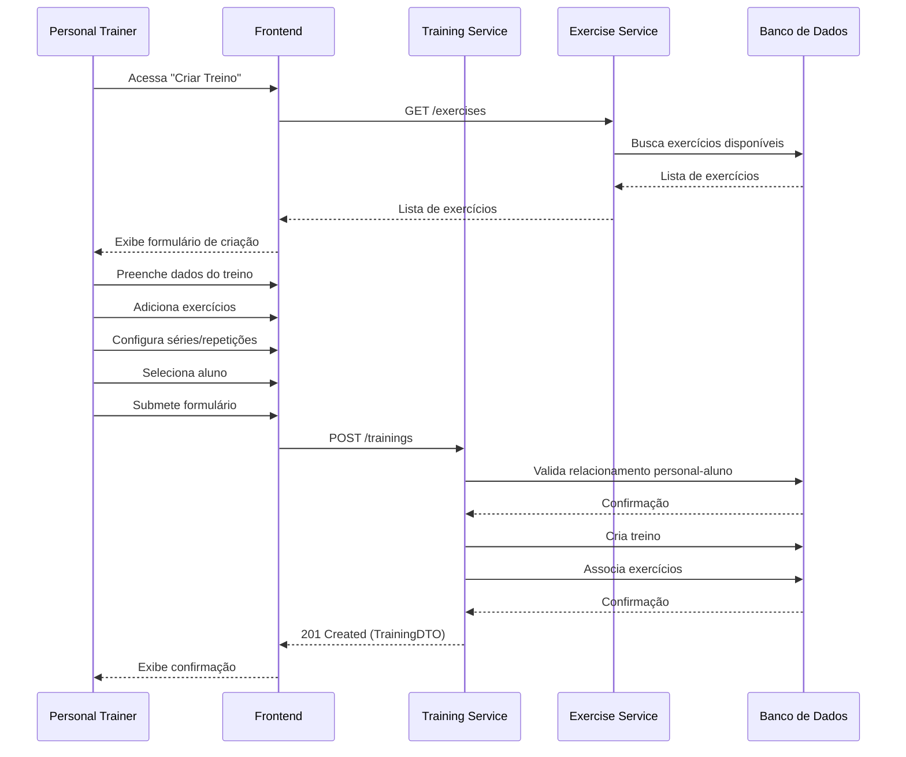
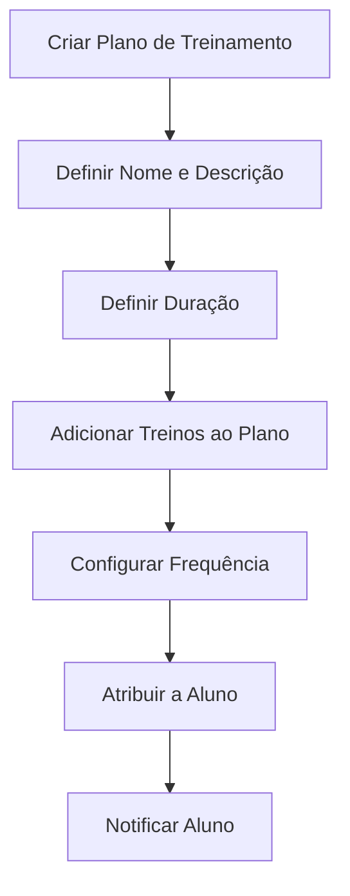
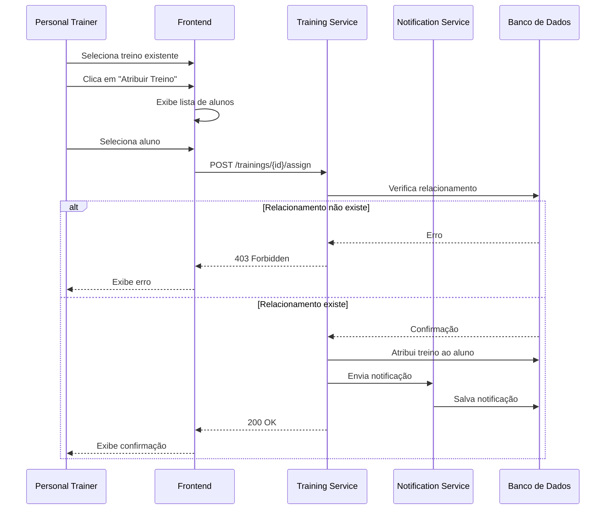

# Criação de Treinos

Este diagrama ilustra o processo completo de criação e atribuição de treinos no ecossistema FitLocus.

## Visão Geral

<Frame>
  <div style={{ padding: '24px', backgroundColor: '#f9f9f9', borderRadius: '8px' }}>
    <p>
      O sistema de criação de treinos do FitLocus permite:
    </p>
    <ul>
      <li>Criação de treinos personalizados por personal trainers</li>
      <li>Seleção de exercícios de uma biblioteca compartilhada</li>
      <li>Definição de séries, repetições e cargas</li>
      <li>Atribuição de treinos a alunos específicos</li>
      <li>Organização de treinos em planos de treinamento</li>
    </ul>
  </div>
</Frame>

## Diagrama de Fluxo de Criação de Treino

<Frame>
  
</Frame>

## Processo de Criação de Treino

O processo de criação de treinos no FitLocus segue estas etapas:



### Detalhes do Processo

1. **Seleção de Exercícios**:
   - Exercícios públicos da biblioteca
   - Exercícios criados pelo personal
   - Filtros por categoria, equipamento, etc.

2. **Configuração de Exercícios**:
   - Número de séries
   - Número de repetições
   - Carga (kg)
   - Tempo de descanso
   - Observações específicas

3. **Atribuição ao Aluno**:
   - Seleção de aluno da lista de alunos do personal
   - Verificação de relacionamento personal-aluno
   - Notificação ao aluno sobre novo treino

## Estrutura de Dados de Treino

```json
{
  "id": 1,
  "name": "Treino A - Superiores",
  "description": "Foco em peito, costas e ombros",
  "personalId": 42,
  "studentId": 123,
  "trainingPlanId": 5,
  "createdAt": "2023-05-10T14:30:00Z",
  "updatedAt": "2023-05-10T14:30:00Z",
  "exercises": [
    {
      "id": 1,
      "exerciseId": 101,
      "exerciseName": "Supino Reto",
      "exerciseCategory": "PEITO",
      "sets": 4,
      "reps": 12,
      "weight": 60,
      "restTime": 90,
      "notes": "Foco na contração do peito",
      "order": 1
    },
    {
      "id": 2,
      "exerciseId": 102,
      "exerciseName": "Puxada Frontal",
      "exerciseCategory": "COSTAS",
      "sets": 4,
      "reps": 10,
      "weight": 70,
      "restTime": 90,
      "notes": "Puxar até o peito",
      "order": 2
    }
  ]
}
```

## Planos de Treinamento

Os treinos podem ser organizados em planos de treinamento, seguindo este fluxo:



### Estrutura de Dados de Plano de Treinamento

```json
{
  "id": 5,
  "name": "Plano Hipertrofia - Intermediário",
  "description": "Plano de 12 semanas para ganho de massa muscular",
  "personalId": 42,
  "studentId": 123,
  "startDate": "2023-05-15T00:00:00Z",
  "endDate": "2023-08-07T00:00:00Z",
  "status": "ACTIVE",
  "createdAt": "2023-05-10T14:30:00Z",
  "updatedAt": "2023-05-10T14:30:00Z",
  "trainings": [
    {
      "id": 1,
      "name": "Treino A - Superiores",
      "frequency": ["MONDAY", "THURSDAY"],
      "order": 1
    },
    {
      "id": 2,
      "name": "Treino B - Inferiores",
      "frequency": ["TUESDAY", "FRIDAY"],
      "order": 2
    },
    {
      "id": 3,
      "name": "Treino C - Core",
      "frequency": ["WEDNESDAY", "SATURDAY"],
      "order": 3
    }
  ]
}
```

## Fluxo de Atribuição de Treino



## Implementação no Backend

No backend, a criação de treinos é gerenciada pelo `TrainingController` e `TrainingService`:

```java
@RestController
@RequestMapping("/api/trainings")
public class TrainingController {
    private final TrainingService trainingService;
    
    // Implementação omitida para brevidade
    
    @PostMapping
    public ResponseEntity<TrainingDTO> createTraining(
            @Valid @RequestBody TrainingCreateRequest request,
            Authentication authentication) {
        User user = (User) authentication.getPrincipal();
        TrainingDTO training = trainingService.createTraining(request, user.getId());
        return ResponseEntity.status(HttpStatus.CREATED).body(training);
    }
    
    @PostMapping("/{id}/assign")
    public ResponseEntity<TrainingDTO> assignTraining(
            @PathVariable Long id,
            @Valid @RequestBody TrainingAssignRequest request,
            Authentication authentication) {
        User user = (User) authentication.getPrincipal();
        TrainingDTO training = trainingService.assignTraining(id, request.getStudentId(), user.getId());
        return ResponseEntity.ok(training);
    }
}
```

## Implementação no Frontend

No frontend, a criação de treinos é gerenciada através de componentes React:

```tsx
// src/components/TrainingForm.tsx
import React, { useState, useEffect } from 'react';
import { useNavigate } from 'react-router-dom';
import { useTrainings } from '../hooks/useTrainings';
import { useExercises } from '../hooks/useExercises';
import { useStudents } from '../hooks/useStudents';

const TrainingForm: React.FC = () => {
  // Implementação omitida para brevidade
  
  return (
    <div className="training-form">
      <h2>Novo Treino</h2>
      
      <form onSubmit={handleSubmit}>
        {/* Campos do formulário */}
        
        <div className="form-group">
          <label htmlFor="name">Nome do Treino *</label>
          <input
            type="text"
            id="name"
            name="name"
            value={formData.name}
            onChange={handleChange}
            required
          />
        </div>
        
        {/* Outros campos */}
        
        <div className="exercise-selection">
          <h3>Exercícios</h3>
          {/* Seleção de exercícios */}
        </div>
        
        <div className="student-selection">
          <h3>Aluno</h3>
          {/* Seleção de aluno */}
        </div>
        
        <button type="submit" disabled={loading}>
          {loading ? 'Criando...' : 'Criar Treino'}
        </button>
      </form>
    </div>
  );
};
```

## Considerações de Segurança

1. **Validação de Relacionamentos**:
   - Verificar se o personal tem permissão para atribuir treinos ao aluno
   - Validar relacionamento personal-aluno antes de criar treino

2. **Validação de Dados**:
   - Validar valores de séries, repetições e cargas
   - Verificar limites máximos para número de exercícios

3. **Controle de Acesso**:
   - Apenas personals podem criar treinos
   - Personals só podem ver e editar treinos criados por eles

## Melhores Práticas

1. **Organização de Treinos**:
   - Agrupar treinos em planos de treinamento
   - Definir frequência semanal para cada treino
   - Estabelecer progressão de cargas ao longo do tempo

2. **Experiência do Usuário**:
   - Interface intuitiva para seleção de exercícios
   - Visualização clara da estrutura do treino
   - Feedback imediato sobre a criação do treino

## Recursos Adicionais

- [Documentação da API de Treinos](/api-reference/trainings/overview)
- [Tutorial de Criação de Plano de Treino](/tutorials/create-training-plan)
- [Exemplos de Código de Integração](/integration/trainings)
