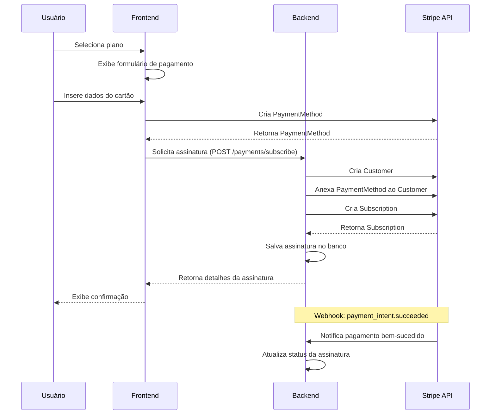

# Integração de Gateway de Pagamento

Este tutorial guiará você através do processo de integração do gateway de pagamento Stripe no ecossistema FitLocus.

## Visão Geral

<Frame>
  <div style={{ padding: '24px', backgroundColor: '#f9f9f9', borderRadius: '8px' }}>
    <p>
      Neste tutorial, você aprenderá a:
    </p>
    <ul>
      <li>Configurar o Stripe no backend</li>
      <li>Implementar processamento de pagamentos</li>
      <li>Gerenciar assinaturas recorrentes</li>
      <li>Implementar webhooks para eventos de pagamento</li>
      <li>Integrar o checkout do Stripe no frontend</li>
    </ul>
  </div>
</Frame>

## Requisitos

Antes de começar, certifique-se de ter:

- Ambiente de desenvolvimento configurado ([Tutorial de Configuração](/tutorials/setup-environment))
- Conhecimento básico de Java e Spring Boot (backend)
- Conhecimento básico de React/TypeScript (frontend)
- Acesso aos repositórios do FitLocus
- Conta no Stripe (você pode criar uma conta de teste gratuita)

## 1. Configuração do Stripe

### 1.1 Criação de Conta no Stripe

1. Acesse [Stripe.com](https://stripe.com/) e crie uma conta
2. No dashboard do Stripe, vá para "Developers" > "API keys"
3. Anote sua chave pública (`publishable key`) e chave secreta (`secret key`)

### 1.2 Configuração do Webhook

1. No dashboard do Stripe, vá para "Developers" > "Webhooks"
2. Clique em "Add endpoint"
3. Para desenvolvimento local, você pode usar [Stripe CLI](https://stripe.com/docs/stripe-cli) para encaminhar eventos para seu ambiente local
4. Para produção, configure o endpoint como `https://seu-dominio.com/api/payments/webhook`
5. Selecione os eventos que deseja receber (recomendados):
   - `payment_intent.succeeded`
   - `payment_intent.payment_failed`
   - `customer.subscription.created`
   - `customer.subscription.updated`
   - `customer.subscription.deleted`
   - `invoice.payment_succeeded`
   - `invoice.payment_failed`
6. Anote o "Signing Secret" para validação de webhooks

## 2. Implementação do Backend

### 2.1 Adição de Dependências

Adicione as dependências do Stripe ao seu arquivo `build.gradle`:

```gradle
dependencies {
    // Outras dependências
    implementation 'com.stripe:stripe-java:22.0.0'
}
```

### 2.2 Configuração do Stripe no Backend

Crie um arquivo `application-dev.properties` em `src/main/resources/`:

```properties
# Configurações do Stripe
stripe.api.key=sua_chave_secreta_stripe
stripe.webhook.secret=seu_segredo_webhook_stripe
```

### 2.3 Modelo de Assinatura

Crie o modelo de dados para assinaturas:

```java
@Entity
@Table(name = "subscriptions")
@Getter @Setter @NoArgsConstructor @AllArgsConstructor @Builder
public class Subscription {
    @Id
    @GeneratedValue(strategy = GenerationType.IDENTITY)
    private Long id;

    @Column(name = "user_id", nullable = false)
    private Long userId;

    @Enumerated(EnumType.STRING)
    @Column(name = "subscription_type", nullable = false)
    private SubscriptionType subscriptionType;

    @Column(name = "start_date", nullable = false)
    private LocalDateTime startDate;

    @Column(name = "end_date", nullable = false)
    private LocalDateTime endDate;

    @Column(name = "stripe_customer_id")
    private String stripeCustomerId;

    @Column(name = "stripe_subscription_id")
    private String stripeSubscriptionId;

    @Column(name = "payment_method")
    private String paymentMethod;

    @Column(nullable = false)
    private String status;

    @Column(name = "auto_renew")
    private Boolean autoRenew;

    @Column(name = "created_at")
    private LocalDateTime createdAt;

    @Column(name = "updated_at")
    private LocalDateTime updatedAt;
}
```

### 2.4 Serviço de Pagamento (Resumido)

```java
@Service
@Transactional
public class PaymentService {
    private final SubscriptionRepository subscriptionRepository;
    private final UserRepository userRepository;
    private final Stripe stripe;
    
    // Métodos principais:
    // - createSubscription(SubscriptionRequest request, Long userId)
    // - getSubscriptionById(Long id, Long userId)
    // - getCurrentSubscription(Long userId)
    // - cancelSubscription(Long id, Long userId)
    // - processWebhookEvent(String payload, String signature)
    
    // Métodos auxiliares para processamento de eventos:
    // - handlePaymentIntentSucceeded(Event event)
    // - handlePaymentIntentFailed(Event event)
    // - handleSubscriptionDeleted(Event event)
    // - handleInvoicePaymentSucceeded(Event event)
    // - handleInvoicePaymentFailed(Event event)
}
```

### 2.5 Controlador de Pagamento

```java
@RestController
@RequestMapping("/api/payments")
public class PaymentController {
    private final PaymentService paymentService;

    // Endpoints:
    // POST /api/payments/subscribe - Criar assinatura
    // GET /api/payments/subscriptions/current - Obter assinatura atual
    // GET /api/payments/subscriptions/{id} - Obter assinatura por ID
    // POST /api/payments/subscriptions/{id}/cancel - Cancelar assinatura
    // POST /api/payments/webhook - Processar eventos do webhook
}
```

## 3. Implementação do Frontend

### 3.1 Instalação de Dependências

```bash
npm install @stripe/stripe-js @stripe/react-stripe-js
```

### 3.2 Provedor do Stripe

```tsx
// src/contexts/StripeContext.tsx
import React from 'react';
import { loadStripe } from '@stripe/stripe-js';
import { Elements } from '@stripe/react-stripe-js';

const stripePromise = loadStripe(process.env.REACT_APP_STRIPE_PUBLIC_KEY!);

export const StripeProvider: React.FC<{ children: React.ReactNode }> = ({ children }) => {
  return (
    <Elements stripe={stripePromise}>
      {children}
    </Elements>
  );
};
```

### 3.3 Componente de Checkout

```tsx
// src/components/SubscriptionCheckout.tsx
import React, { useState } from 'react';
import { useStripe, useElements, CardElement } from '@stripe/react-stripe-js';
import paymentService from '../services/payment.service';

const SubscriptionCheckout: React.FC<{ subscriptionType: string }> = ({ subscriptionType }) => {
  const stripe = useStripe();
  const elements = useElements();
  const [loading, setLoading] = useState(false);
  
  const handleSubmit = async (e: React.FormEvent) => {
    e.preventDefault();
    
    if (!stripe || !elements) return;
    
    const cardElement = elements.getElement(CardElement);
    if (!cardElement) return;
    
    setLoading(true);
    
    try {
      // Criar método de pagamento
      const { paymentMethod } = await stripe.createPaymentMethod({
        type: 'card',
        card: cardElement,
      });
      
      // Criar assinatura
      await paymentService.createSubscription({
        subscriptionType,
        paymentMethodId: paymentMethod!.id,
      });
      
      // Redirecionar para página de sucesso
    } catch (error) {
      console.error(error);
    } finally {
      setLoading(false);
    }
  };
  
  return (
    <form onSubmit={handleSubmit}>
      <CardElement />
      <button type="submit" disabled={!stripe || loading}>
        {loading ? 'Processando...' : 'Assinar'}
      </button>
    </form>
  );
};
```

## 4. Fluxo de Pagamento



## 5. Considerações de Segurança

1. **Proteção de Dados de Pagamento**:
   - Nunca armazene dados completos de cartão
   - Use Stripe Elements para coletar dados de forma segura
   - Implemente HTTPS em todas as comunicações

2. **Validação de Webhooks**:
   - Verifique a assinatura de todos os eventos
   - Implemente idempotência para evitar processamento duplicado

3. **Controle de Acesso**:
   - Verifique permissões para todas as operações de assinatura
   - Implemente autenticação para todas as rotas de pagamento

## 6. Testes

### 6.1 Cartões de Teste

| Número do Cartão | Descrição |
|------------------|-----------|
| 4242 4242 4242 4242 | Pagamento bem-sucedido |
| 4000 0000 0000 0002 | Cartão recusado |
| 4000 0000 0000 3220 | Requer autenticação 3D Secure |

### 6.2 Testando Webhooks

Use o Stripe CLI para testar webhooks localmente:

```bash
stripe listen --forward-to http://localhost:8080/api/payments/webhook
```

## Próximos Passos

Agora que você implementou o gateway de pagamento, você pode:

1. [Criar um Plano de Treino](/tutorials/create-training-plan)
2. [Implementar Autenticação](/tutorials/implement-authentication)

## Recursos Adicionais

- [Documentação da API de Pagamentos](/api-reference/payments/overview)
- [Exemplos de Código de Integração](/integration/payments)
- [Diagramas de Fluxo](/diagrams/payment-processing)
