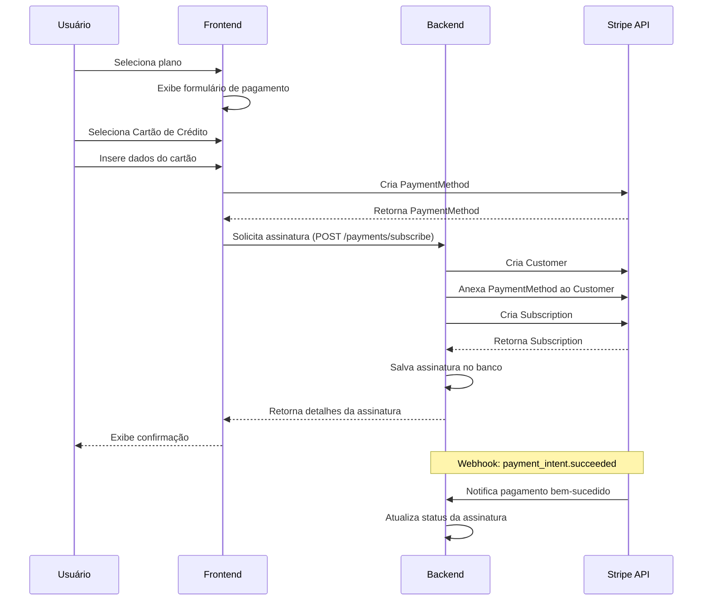
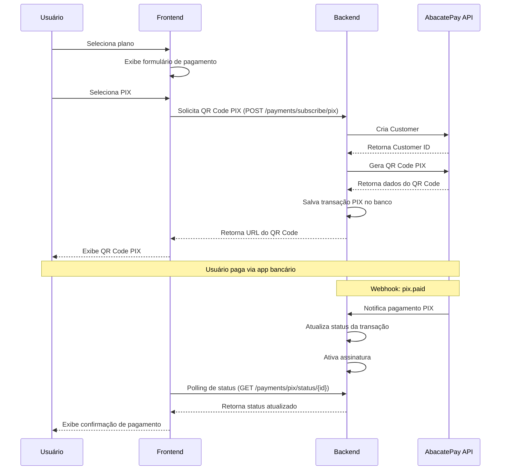

# Integração de Gateway de Pagamento

Este tutorial guiará você através do processo de integração dos gateways de pagamento Stripe (cartão de crédito) e AbacatePay (PIX) no ecossistema FitLocus.

## Visão Geral

<Frame>
  <div style={{ padding: '24px', backgroundColor: '#f9f9f9', borderRadius: '8px' }}>
    <p>
      Neste tutorial, você aprenderá a:
    </p>
    <ul>
      <li>Configurar o Stripe e AbacatePay no backend</li>
      <li>Implementar processamento de pagamentos com cartão de crédito e PIX</li>
      <li>Gerenciar assinaturas recorrentes</li>
      <li>Implementar webhooks para eventos de pagamento</li>
      <li>Integrar o checkout de ambos os gateways no frontend</li>
    </ul>
  </div>
</Frame>

## Requisitos

Antes de começar, certifique-se de ter:

- Ambiente de desenvolvimento configurado ([Tutorial de Configuração](/tutorials/setup-environment))
- Conhecimento básico de Java e Spring Boot (backend)
- Conhecimento básico de React/TypeScript (frontend)
- Acesso aos repositórios do FitLocus
- Conta no Stripe (você pode criar uma conta de teste gratuita)
- Conta no AbacatePay (você pode criar uma conta de teste gratuita)

## 1. Configuração dos Gateways de Pagamento

### 1.1 Configuração do Stripe (Cartão de Crédito)

#### 1.1.1 Criação de Conta no Stripe

1. Acesse [Stripe.com](https://stripe.com/) e crie uma conta
2. No dashboard do Stripe, vá para "Developers" > "API keys"
3. Anote sua chave pública (`publishable key`) e chave secreta (`secret key`)

#### 1.1.2 Configuração do Webhook do Stripe

1. No dashboard do Stripe, vá para "Developers" > "Webhooks"
2. Clique em "Add endpoint"
3. Para desenvolvimento local, você pode usar [Stripe CLI](https://stripe.com/docs/stripe-cli) para encaminhar eventos para seu ambiente local
4. Para produção, configure o endpoint como `https://seu-dominio.com/api/webhooks/stripe`
5. Selecione os eventos que deseja receber (recomendados):
   - `payment_intent.succeeded`
   - `payment_intent.payment_failed`
   - `customer.subscription.created`
   - `customer.subscription.updated`
   - `customer.subscription.deleted`
   - `invoice.payment_succeeded`
   - `invoice.payment_failed`
6. Anote o "Signing Secret" para validação de webhooks

### 1.2 Configuração do AbacatePay (PIX)

#### 1.2.1 Criação de Conta no AbacatePay

1. Acesse [AbacatePay.com](https://abacatepay.com/) e crie uma conta
2. No dashboard do AbacatePay, vá para "Configurações" > "API"
3. Anote sua chave de API (`api_key`) e segredo de API (`api_secret`)

#### 1.2.2 Configuração do Webhook do AbacatePay

1. No dashboard do AbacatePay, vá para "Configurações" > "Webhooks"
2. Clique em "Adicionar webhook"
3. Para produção, configure o endpoint como `https://seu-dominio.com/api/webhooks/abacatepay/payment`
4. Selecione os eventos que deseja receber:
   - `pix.paid`
   - `pix.expired`
   - `pix.cancelled`
5. Anote o "Segredo do Webhook" para validação de webhooks

## 2. Implementação do Backend

### 2.1 Adição de Dependências

Adicione as dependências do Stripe ao seu arquivo `build.gradle`:

```gradle
dependencies {
    // Outras dependências
    implementation 'com.stripe:stripe-java:22.0.0'
}
```

### 2.2 Configuração do Stripe no Backend

Crie um arquivo `application-dev.properties` em `src/main/resources/`:

```properties
# Configurações do Stripe
stripe.api.key=sua_chave_secreta_stripe
stripe.webhook.secret=seu_segredo_webhook_stripe
```

### 2.3 Modelos de Dados

#### 2.3.1 Modelo de Assinatura

Crie o modelo de dados para assinaturas:

```java
@Entity
@Table(name = "subscriptions")
@Getter @Setter @NoArgsConstructor @AllArgsConstructor @Builder
public class Subscription {
    @Id
    @GeneratedValue(strategy = GenerationType.IDENTITY)
    private Long id;

    @Column(name = "user_id", nullable = false)
    private Long userId;

    @Enumerated(EnumType.STRING)
    @Column(name = "subscription_type", nullable = false)
    private SubscriptionType subscriptionType;

    @Column(name = "start_date", nullable = false)
    private LocalDateTime startDate;

    @Column(name = "end_date", nullable = false)
    private LocalDateTime endDate;

    @Column(name = "stripe_customer_id")
    private String stripeCustomerId;

    @Column(name = "stripe_subscription_id")
    private String stripeSubscriptionId;
    
    @Column(name = "abacatepay_customer_id")
    private String abacatepayCustomerId;

    @Enumerated(EnumType.STRING)
    @Column(name = "payment_method", nullable = false)
    private PaymentMethodType paymentMethod;

    @Column(nullable = false)
    private String status;

    @Column(name = "auto_renew")
    private Boolean autoRenew;

    @Column(name = "created_at")
    private LocalDateTime createdAt;

    @Column(name = "updated_at")
    private LocalDateTime updatedAt;
}

public enum PaymentMethodType {
    CREDIT_CARD,
    PIX
}
```

#### 2.3.2 Modelo de Transação PIX

Crie o modelo para transações PIX:

```java
@Entity
@Table(name = "pix_transaction")
@Data
@NoArgsConstructor
@AllArgsConstructor
@Builder
public class PixTransaction {

    @Id
    private String id; // transactionId vindo da AbacatePay

    @Column(nullable = false)
    private String customerId;

    @Column(nullable = false)
    private String planTier;

    @Column(nullable = false)
    private String billingPeriod;

    @Column(nullable = false)
    private Integer amount; // em centavos

    @Column(nullable = false)
    @Enumerated(EnumType.STRING)
    private EnumStatus status;

    @Column(name = "payment_url", nullable = false)
    private String paymentUrl;

    @Column(name = "created_at", nullable = false)
    @Builder.Default
    private LocalDateTime createdAt = LocalDateTime.now();
}
```

### 2.4 Serviços de Pagamento

#### 2.4.1 Serviço de Pagamento Principal

```java
@Service
@Transactional
public class PaymentService {
    private final SubscriptionRepository subscriptionRepository;
    private final UserRepository userRepository;
    private final StripeService stripeService;
    private final AbacatePayService abacatePayService;
    private final PixTransactionRepository pixTransactionRepository;
    
    // Métodos principais:
    // - createSubscription(SubscriptionRequest request, Long userId)
    // - createPixSubscription(PixSubscriptionRequest request, Long userId)
    // - getSubscriptionById(Long id, Long userId)
    // - getCurrentSubscription(Long userId)
    // - cancelSubscription(Long id, Long userId)
    // - getPixTransactionStatus(String transactionId, Long userId)
    
    // Implementação do método de criação de assinatura com PIX
    public PixTransactionDTO createPixSubscription(PixSubscriptionRequest request, Long userId) {
        User user = userRepository.findById(userId)
            .orElseThrow(() -> new ResourceNotFoundException("Usuário não encontrado"));
        
        // Criar ou recuperar cliente no AbacatePay
        String customerId;
        if (user.getAbacatepayCustomerId() == null) {
            customerId = abacatePayService.createCustomer(
                user.getName(), 
                user.getEmail(), 
                user.getTaxId()
            );
            user.setAbacatepayCustomerId(customerId);
            userRepository.save(user);
        } else {
            customerId = user.getAbacatepayCustomerId();
        }
        
        // Calcular valor com base no plano e período
        Integer amount = calculateAmount(request.getPlanTier(), request.getBillingPeriod());
        
        // Criar transação PIX
        PixTransaction pixTransaction = abacatePayService.createPixPayment(
            customerId,
            request.getPlanTier(),
            request.getBillingPeriod(),
            amount
        );
        
        // Criar assinatura pendente
        Subscription subscription = Subscription.builder()
            .userId(userId)
            .subscriptionType(SubscriptionType.valueOf(request.getPlanTier()))
            .startDate(LocalDateTime.now())
            .endDate(calculateEndDate(request.getBillingPeriod()))
            .abacatepayCustomerId(customerId)
            .paymentMethod(PaymentMethodType.PIX)
            .status("PENDING")
            .autoRenew(false) // PIX não suporta renovação automática
            .createdAt(LocalDateTime.now())
            .build();
        
        subscriptionRepository.save(subscription);
        
        return new PixTransactionDTO(
            pixTransaction.getId(),
            pixTransaction.getPaymentUrl(),
            pixTransaction.getStatus().toString(),
            pixTransaction.getAmount()
        );
    }
}
```

#### 2.4.2 Serviço Stripe

```java
@Service
public class StripeService {
    @Value("${stripe.api.key}")
    private String stripeApiKey;
    
    @PostConstruct
    public void init() {
        Stripe.apiKey = stripeApiKey;
    }
    
    // Métodos para integração com Stripe
    // - createCustomer(String email, String name)
    // - createPaymentIntent(Long amount, String currency, String customerId)
    // - createSubscription(String customerId, String priceId)
    // - processWebhookEvent(String payload, String signature)
}
```

#### 2.4.3 Serviço AbacatePay

```java
@Service
public class AbacatePayService {
    @Value("${abacatepay.api.key}")
    private String apiKey;
    
    @Value("${abacatepay.api.secret}")
    private String apiSecret;
    
    @Value("${abacatepay.api.url}")
    private String apiUrl;
    
    private final WebClient webClient;
    private final PixTransactionRepository pixTransactionRepository;
    
    // Métodos para integração com AbacatePay
    // - createCustomer(String name, String email, String taxId)
    // - createPixPayment(String customerId, String planTier, String billingPeriod, Integer amount)
    // - getPixStatus(String transactionId)
    // - processWebhookEvent(String payload, String signature)
}
```

### 2.5 Controladores de Pagamento

#### 2.5.1 Controlador Principal de Pagamento

```java
@RestController
@RequestMapping("/api/payments")
public class PaymentController {
    private final PaymentService paymentService;

    // Endpoints:
    // POST /api/payments/subscribe - Criar assinatura com cartão
    // POST /api/payments/subscribe/pix - Criar assinatura com PIX
    // GET /api/payments/subscriptions/current - Obter assinatura atual
    // GET /api/payments/subscriptions/{id} - Obter assinatura por ID
    // POST /api/payments/subscriptions/{id}/cancel - Cancelar assinatura
    // GET /api/payments/pix/status/{transactionId} - Verificar status de transação PIX
}
```

#### 2.5.2 Controladores de Webhook

```java
@RestController
@RequestMapping("/api/webhooks/stripe")
public class StripeWebhookController {
    private final StripeService stripeService;
    
    @PostMapping
    public ResponseEntity<String> handleStripeWebhook(
            @RequestHeader("Stripe-Signature") String signature,
            @RequestBody String payload) {
        // Processar webhook do Stripe
        stripeService.processWebhookEvent(payload, signature);
        return ResponseEntity.ok().build();
    }
}

@RestController
@RequestMapping("/api/webhooks/abacatepay")
public class AbacatePayWebhookController {
    private final AbacatePayService abacatePayService;
    
    @PostMapping("/payment")
    public ResponseEntity<String> handleAbacatePayWebhook(
            @RequestHeader("X-Webhook-Secret") String signature,
            @RequestBody String payload) {
        // Processar webhook do AbacatePay
        abacatePayService.processWebhookEvent(payload, signature);
        return ResponseEntity.ok().build();
    }
}
```

## 3. Implementação do Frontend

### 3.1 Instalação de Dependências

```bash
npm install @stripe/stripe-js @stripe/react-stripe-js
```

### 3.2 Contexto de Pagamento

```tsx
// src/contexts/PaymentContext.tsx
import React, { createContext, useContext, useState } from 'react';
import { loadStripe } from '@stripe/stripe-js';
import { Elements } from '@stripe/react-stripe-js';

const stripePromise = loadStripe(process.env.REACT_APP_STRIPE_PUBLIC_KEY!);

type PaymentMethod = 'CREDIT_CARD' | 'PIX';

interface PaymentContextType {
  paymentMethod: PaymentMethod;
  setPaymentMethod: (method: PaymentMethod) => void;
  pixQrCodeUrl: string | null;
  setPixQrCodeUrl: (url: string | null) => void;
  pixTransactionId: string | null;
  setPixTransactionId: (id: string | null) => void;
}

const PaymentContext = createContext<PaymentContextType | undefined>(undefined);

export const PaymentProvider: React.FC<{ children: React.ReactNode }> = ({ children }) => {
  const [paymentMethod, setPaymentMethod] = useState<PaymentMethod>('CREDIT_CARD');
  const [pixQrCodeUrl, setPixQrCodeUrl] = useState<string | null>(null);
  const [pixTransactionId, setPixTransactionId] = useState<string | null>(null);

  return (
    <PaymentContext.Provider value={{
      paymentMethod,
      setPaymentMethod,
      pixQrCodeUrl,
      setPixQrCodeUrl,
      pixTransactionId,
      setPixTransactionId
    }}>
      <Elements stripe={stripePromise}>
        {children}
      </Elements>
    </PaymentContext.Provider>
  );
};

export const usePayment = () => {
  const context = useContext(PaymentContext);
  if (context === undefined) {
    throw new Error('usePayment must be used within a PaymentProvider');
  }
  return context;
};
```

### 3.3 Componente de Seleção de Método de Pagamento

```tsx
// src/components/PaymentMethodSelector.tsx
import React from 'react';
import { usePayment } from '../contexts/PaymentContext';

const PaymentMethodSelector: React.FC = () => {
  const { paymentMethod, setPaymentMethod } = usePayment();
  
  return (
    <div className="payment-method-selector">
      <h3>Selecione o método de pagamento</h3>
      <div className="payment-methods">
        <div
          className={`payment-method ${paymentMethod === 'CREDIT_CARD' ? 'selected' : ''}`}
          onClick={() => setPaymentMethod('CREDIT_CARD')}
        >
          <i className="icon-credit-card"></i>
          <span>Cartão de Crédito</span>
        </div>
        <div
          className={`payment-method ${paymentMethod === 'PIX' ? 'selected' : ''}`}
          onClick={() => setPaymentMethod('PIX')}
        >
          <i className="icon-pix"></i>
          <span>PIX</span>
        </div>
      </div>
    </div>
  );
};

export default PaymentMethodSelector;
```

### 3.4 Componente de Checkout com Cartão de Crédito

```tsx
// src/components/CreditCardCheckout.tsx
import React, { useState } from 'react';
import { useStripe, useElements, CardElement } from '@stripe/react-stripe-js';
import paymentService from '../services/payment.service';

const CreditCardCheckout: React.FC<{ subscriptionType: string }> = ({ subscriptionType }) => {
  const stripe = useStripe();
  const elements = useElements();
  const [loading, setLoading] = useState(false);
  
  const handleSubmit = async (e: React.FormEvent) => {
    e.preventDefault();
    
    if (!stripe || !elements) return;
    
    const cardElement = elements.getElement(CardElement);
    if (!cardElement) return;
    
    setLoading(true);
    
    try {
      // Criar método de pagamento
      const { paymentMethod } = await stripe.createPaymentMethod({
        type: 'card',
        card: cardElement,
      });
      
      // Criar assinatura
      await paymentService.createSubscription({
        subscriptionType,
        paymentMethodId: paymentMethod!.id,
      });
      
      // Redirecionar para página de sucesso
    } catch (error) {
      console.error(error);
    } finally {
      setLoading(false);
    }
  };
  
  return (
    <form onSubmit={handleSubmit}>
      <CardElement />
      <button type="submit" disabled={!stripe || loading}>
        {loading ? 'Processando...' : 'Assinar'}
      </button>
    </form>
  );
};

export default CreditCardCheckout;
```

### 3.5 Componente de Checkout com PIX

```tsx
// src/components/PixCheckout.tsx
import React, { useState } from 'react';
import { usePayment } from '../contexts/PaymentContext';
import paymentService from '../services/payment.service';

const PixCheckout: React.FC<{ subscriptionType: string }> = ({ subscriptionType }) => {
  const { setPixQrCodeUrl, setPixTransactionId } = usePayment();
  const [loading, setLoading] = useState(false);
  const [qrCodeUrl, setQrCodeUrl] = useState<string | null>(null);
  const [transactionId, setTransactionId] = useState<string | null>(null);
  
  const handleGeneratePixQrCode = async () => {
    setLoading(true);
    
    try {
      // Criar assinatura com PIX
      const response = await paymentService.createPixSubscription({
        planTier: subscriptionType,
        billingPeriod: 'MONTHLY',
      });
      
      setQrCodeUrl(response.paymentUrl);
      setTransactionId(response.id);
      
      // Atualizar contexto
      setPixQrCodeUrl(response.paymentUrl);
      setPixTransactionId(response.id);
      
      // Iniciar polling de status
      startPollingStatus(response.id);
    } catch (error) {
      console.error(error);
    } finally {
      setLoading(false);
    }
  };
  
  const startPollingStatus = (id: string) => {
    const interval = setInterval(async () => {
      try {
        const status = await paymentService.getPixStatus(id);
        if (status === 'PAID') {
          clearInterval(interval);
          // Redirecionar para página de sucesso
        } else if (status === 'EXPIRED' || status === 'CANCELLED') {
          clearInterval(interval);
          // Exibir mensagem de erro
        }
      } catch (error) {
        console.error(error);
      }
    }, 5000); // Verificar a cada 5 segundos
  };
  
  return (
    <div className="pix-checkout">
      {!qrCodeUrl ? (
        <button 
          onClick={handleGeneratePixQrCode} 
          disabled={loading}
        >
          {loading ? 'Gerando QR Code...' : 'Gerar QR Code PIX'}
        </button>
      ) : (
        <div className="pix-qrcode-container">
          <h4>Escaneie o QR Code para pagar</h4>
          
          <p>Após o pagamento, você será redirecionado automaticamente.</p>
        </div>
      )}
    </div>
  );
};

export default PixCheckout;
```

### 3.6 Componente de Checkout Unificado

```tsx
// src/components/SubscriptionCheckout.tsx
import React from 'react';
import { usePayment } from '../contexts/PaymentContext';
import PaymentMethodSelector from './PaymentMethodSelector';
import CreditCardCheckout from './CreditCardCheckout';
import PixCheckout from './PixCheckout';

const SubscriptionCheckout: React.FC<{ subscriptionType: string }> = ({ subscriptionType }) => {
  const { paymentMethod } = usePayment();
  
  return (
    <div className="subscription-checkout">
      <PaymentMethodSelector />
      
      {paymentMethod === 'CREDIT_CARD' ? (
        <CreditCardCheckout subscriptionType={subscriptionType} />
      ) : (
        <PixCheckout subscriptionType={subscriptionType} />
      )}
    </div>
  );
};
```

## 4. Fluxos de Pagamento

### 4.1 Fluxo de Pagamento com Cartão de Crédito (Stripe)



### 4.2 Fluxo de Pagamento com PIX (AbacatePay)



## 5. Considerações de Segurança

1. **Proteção de Dados de Pagamento**:
   - Nunca armazene dados completos de cartão
   - Use Stripe Elements para coletar dados de forma segura
   - Implemente HTTPS em todas as comunicações

2. **Validação de Webhooks**:
   - Verifique a assinatura de todos os eventos
   - Implemente idempotência para evitar processamento duplicado

3. **Controle de Acesso**:
   - Verifique permissões para todas as operações de assinatura
   - Implemente autenticação para todas as rotas de pagamento

## 6. Testes

### 6.1 Testes de Pagamento com Cartão (Stripe)

#### 6.1.1 Cartões de Teste

| Número do Cartão | Descrição |
|------------------|-----------|
| 4242 4242 4242 4242 | Pagamento bem-sucedido |
| 4000 0000 0000 0002 | Cartão recusado |
| 4000 0000 0000 3220 | Requer autenticação 3D Secure |

#### 6.1.2 Testando Webhooks do Stripe

Use o Stripe CLI para testar webhooks localmente:

```bash
stripe listen --forward-to http://localhost:8080/api/webhooks/stripe
```

### 6.2 Testes de Pagamento com PIX (AbacatePay)

#### 6.2.1 Ambiente de Sandbox

O AbacatePay fornece um ambiente de sandbox para testes. Para utilizá-lo:

1. Configure suas chaves de API para o ambiente de sandbox:
   ```properties
   abacatepay.api.url=https://sandbox.abacatepay.com
   abacatepay.api.key=sua_chave_sandbox
   abacatepay.api.secret=seu_segredo_sandbox
   ```

2. Use o CPF de teste `123.456.789-00` para criar clientes no ambiente de sandbox.

#### 6.2.2 Simulando Pagamentos PIX

Para simular um pagamento PIX no ambiente de sandbox:

1. Gere um QR Code PIX normalmente através da API
2. Use a API de simulação para "pagar" o PIX:
   ```bash
   curl -X POST \
     -H "X-API-Key: sua_chave_sandbox" \
     -H "X-API-Secret: seu_segredo_sandbox" \
     -H "Content-Type: application/json" \
     -d '{"status": "PAID"}' \
     https://sandbox.abacatepay.com/pix/simulate/{transaction_id}
   ```

3. O webhook será acionado automaticamente após a simulação

#### 6.2.3 Testando Webhooks do AbacatePay

Para testar webhooks do AbacatePay localmente:

1. Use uma ferramenta como [ngrok](https://ngrok.com/) para expor seu servidor local:
   ```bash
   ngrok http 8080
   ```

2. Configure o URL do webhook no dashboard do AbacatePay sandbox para o URL fornecido pelo ngrok:
   ```
   https://seu-ngrok-url.ngrok.io/api/webhooks/abacatepay/payment
   ```

3. Simule um pagamento PIX conforme descrito acima para acionar o webhook

## Próximos Passos

Agora que você implementou o gateway de pagamento, você pode:

1. [Criar um Plano de Treino](/tutorials/create-training-plan)
2. [Implementar Autenticação](/tutorials/implement-authentication)

## Recursos Adicionais

- [Documentação da API de Pagamentos](/api-reference/payments/overview)
- [Exemplos de Código de Integração](/integration/payments)
- [Diagramas de Fluxo](/diagrams/payment-processing)
